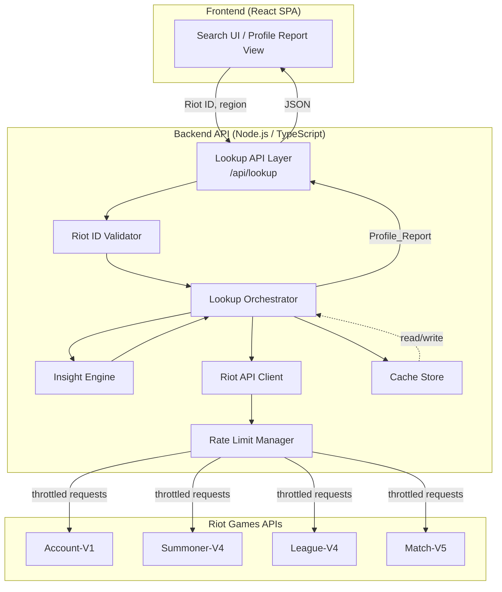
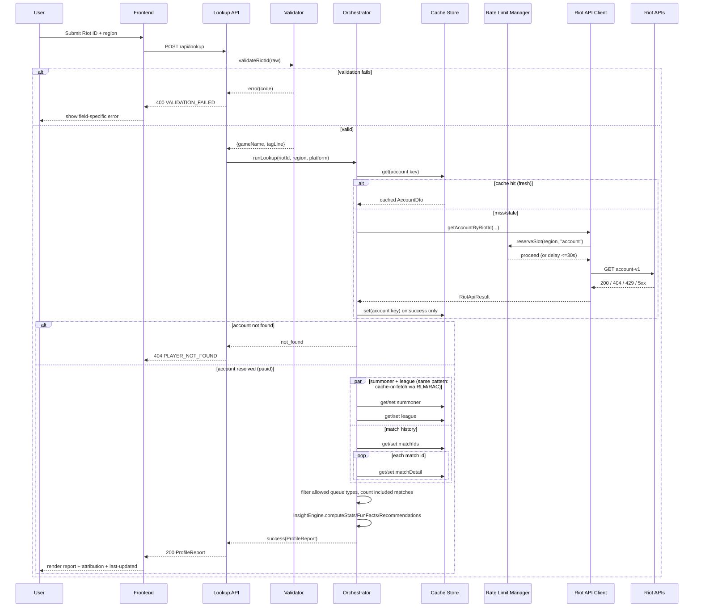

# Design Document

## Overview

lolprofiles.gg is a two-tier web application: a React frontend and a Node.js/TypeScript backend API. The backend is the only component that talks to Riot Games' public APIs (Account-V1, Summoner-V4, League-V4, Match-V5). It resolves a Riot ID into a `Profile_Report` by orchestrating account resolution, summoner/league lookups, and match history retrieval, then runs the results through an `Insight_Engine` to produce fun facts and improvement recommendations.

The two hard constraints that shape the architecture are:

1. **Riot's rate limits are strict and shared across the whole application** (not per-user), so every outgoing request must pass through a single `Rate_Limit_Manager` that understands Riot's per-app and per-method windows.
2. **Most of the data needed for a lookup rarely changes within short windows** (summoner level, ranked standing, and especially completed matches), so a `Cache_Store` sits in front of the `Riot_API_Client` and is the primary lever for meeting the 2s (cached) / 15s (fresh) p95 performance targets.

The backend never returns the Riot API key to the frontend, and it enforces Riot ToS obligations (attribution, no ads on Riot-data pages, bounded retention, deletion-on-request) at the service layer rather than leaving them to be "remembered" by page authors.

## Architecture



Key architectural decisions:

- **Single backend process boundary for Riot access.** The frontend never has network access to Riot's APIs or the API key; it only calls the backend's own `/api/lookup` endpoint. This satisfies Requirement 4.2 (no key leakage) by construction rather than by convention.
- **Cache-first orchestration.** The Lookup Orchestrator always checks the `Cache_Store` before invoking the `Riot_API_Client`, for every sub-request (account, summoner, league, each match). This is what makes the 2s cached-path target (Requirement 11.1) achievable, and it's also what keeps the app within Riot's rate limits on popular profiles.
- **Rate limiting is centralized, not per-call.** All outgoing Riot requests funnel through one `Rate_Limit_Manager` instance (per routing value), because Riot's limits are enforced by Riot per API key + routing value, not per user session. This directly implements Requirement 4.3–4.8.
- **Insight generation is a pure, cache-independent step.** Once account/summoner/league/match data is assembled in memory, `Insight_Engine` is a pure function over that data with no I/O. This isolation is what makes stats/fun-facts/recommendations logic (Requirements 6, 7, 8) amenable to property-based testing.

## Components and Interfaces

### Riot ID Validator

Pure function, no I/O.

```typescript
interface RiotIdValidationResult {
  ok: boolean;
  riotId?: { gameName: string; tagLine: string };
  errorCode?: 'MISSING_HASH' | 'MULTIPLE_HASH' | 'EMPTY_PART' | 'GAME_NAME_TOO_LONG' | 'TAG_LINE_TOO_LONG';
}

function validateRiotId(raw: string): RiotIdValidationResult;
```

Implements Requirement 1.2–1.5: exactly one `#`, both parts non-empty after trim, gameName ≤ 16 chars, tagLine ≤ 5 chars.

### Region Router

Pure function, no I/O. Owns the closed mapping from Requirement 5.

```typescript
type RegionalRoutingValue = 'americas' | 'europe' | 'asia' | 'sea';
type PlatformRoutingValue = 'na1' | 'br1' | 'la1' | 'la2' | 'euw1' | 'eun1' | 'tr1' | 'ru' | 'kr' | 'jp1' | 'oc1';

const REGION_TO_PLATFORMS: Readonly<Record<RegionalRoutingValue, readonly PlatformRoutingValue[]>> = {
  americas: ['na1', 'br1', 'la1', 'la2'],
  europe: ['euw1', 'eun1', 'tr1', 'ru'],
  asia: ['kr', 'jp1'],
  sea: ['oc1'],
};

function isValidRegion(value: string): value is RegionalRoutingValue;
function platformsFor(region: RegionalRoutingValue): readonly PlatformRoutingValue[];
function resolvePlatform(region: RegionalRoutingValue, requestedPlatform: string | undefined): PlatformRoutingValue;
```

`resolvePlatform` returns `requestedPlatform` unchanged if it belongs to `REGION_TO_PLATFORMS[region]`, otherwise returns the first entry for that region (Requirement 5.4). Callers reject the whole request (Requirement 5.5) before this point if `region` itself isn't in `REGION_TO_PLATFORMS`.

### Riot API Client

Owns HTTP calls to Riot, request signing (API key header), per-call 10s timeout, and 429 retry handling. Never returns the raw API key to any caller outside itself.

```typescript
interface RiotApiClient {
  getAccountByRiotId(region: RegionalRoutingValue, gameName: string, tagLine: string): Promise<RiotApiResult<AccountDto>>;
  getSummonerByPuuid(platform: PlatformRoutingValue, puuid: string): Promise<RiotApiResult<SummonerDto>>;
  getLeagueEntriesByPuuid(platform: PlatformRoutingValue, puuid: string): Promise<RiotApiResult<LeagueEntryDto[]>>;
  getMatchIdsByPuuid(region: RegionalRoutingValue, puuid: string, count: number): Promise<RiotApiResult<string[]>>;
  getMatchById(region: RegionalRoutingValue, matchId: string): Promise<RiotApiResult<MatchDto>>;
}

type RiotApiResult<T> =
  | { kind: 'ok'; data: T }
  | { kind: 'not_found' }
  | { kind: 'rate_limited'; retryAfterSeconds?: number }
  | { kind: 'server_error'; status: 500 | 502 | 503 | 504 }
  | { kind: 'auth_error'; status: 401 | 403 }
  | { kind: 'timeout' }
  | { kind: 'network_error' };
```

Every method internally: (1) asks `Rate_Limit_Manager` for clearance before sending, (2) sends with a 10s timeout (Requirement 2.6 / 9.4), (3) on HTTP 429 retries up to 2 times honoring `Retry-After` (or 5s default) per Requirement 4.6–4.8, (4) never logs or forwards the API key value in any result object.

### Rate Limit Manager

Tracks Riot's `X-App-Rate-Limit`/`X-App-Rate-Limit-Count` and `X-Method-Rate-Limit`/`X-Method-Rate-Limit-Count` headers per routing value and per method, using a sliding/fixed window counter per Riot's documented window durations.

```typescript
interface RateLimitManager {
  // Returns the delay (ms) the caller must wait before sending, or throws RateLimitExceededError
  // if the wait would exceed 30 seconds (Requirement 4.4 / 4.5).
  reserveSlot(routingValue: string, method: string): Promise<void>;
  recordResponseHeaders(routingValue: string, method: string, headers: Headers): void;
}

class RateLimitExceededError extends Error {}
```

`reserveSlot` computes `requiredWaitMs` from currently tracked window usage; if `requiredWaitMs <= 30000` it awaits that long before returning, otherwise it throws immediately so the caller can surface Requirement 4.5's message without ever actually waiting past 30s.

### Cache Store

Key-value store abstraction with TTL semantics, backed by an in-memory LRU for single-instance deployments and swappable for Redis when running multiple backend instances (see Technology Choices).

```typescript
interface CacheStore {
  get<T>(key: CacheKey): Promise<CacheEntry<T> | undefined>;
  set<T>(key: CacheKey, value: T, ttlMs: number | 'infinite'): Promise<void>;
  deleteByPuuid(puuid: string): Promise<PuuidDeletionResult>;
}

interface PuuidDeletionResult {
  found: boolean;                    // any data existed for this PUUID (Requirement 12.5/12.6)
  removedEntryCount: number;         // non-matchDetail entries deleted
  removedMatchDetailCount: number;   // matchDetail entries evicted (subject participated)
}

interface CacheKey {
  endpoint: 'account' | 'summoner' | 'league' | 'matchIds' | 'matchDetail';
  routingValue: string; // regional or platform value used for this call
  params: Record<string, string>; // e.g. { gameName, tagLine } or { puuid } or { matchId }
}

interface CacheEntry<T> {
  value: T;
  retrievedAt: number; // epoch ms
  ttlMs: number | 'infinite';
}
```

Cache key construction is deterministic: `hash(endpoint, routingValue, sortedParamEntries)`. `deleteByPuuid` is a scan over every entry: **every** entry in which the PUUID appears — in a key param or anywhere in the cached value, at any depth — is removed, `matchDetail` entries included (see Caching Strategy below). It returns a `PuuidDeletionResult` rather than `void` because Requirements 12.5/12.6 and the `/api/privacy/delete` response require reporting whether data existed.

### Lookup Orchestrator

The core coordination logic; this is what Requirements 2, 3, 9, 10, 11 are really specifying. It is written as a pure-ish pipeline over injected `RiotApiClient` and `CacheStore` so it can be property-tested with fakes/mocks instead of real network calls.

```typescript
interface LookupOrchestrator {
  runLookup(input: { riotId: { gameName: string; tagLine: string }; region: RegionalRoutingValue; platform?: string }): Promise<LookupResult>;
}

type LookupResult =
  | { kind: 'success'; report: ProfileReport }
  | { kind: 'not_found'; gameName: string; tagLine: string }
  | { kind: 'error'; code: ErrorCode; retriable: boolean };

type ErrorCode =
  | 'VALIDATION_FAILED' | 'UNSUPPORTED_REGION' | 'PLAYER_NOT_FOUND' | 'PLAYER_NOT_ON_PLATFORM'
  | 'RIOT_UNAVAILABLE' | 'TIMEOUT' | 'RATE_LIMITED' | 'AUTH_FAILURE' | 'NETWORK_ERROR' | 'MATCH_HISTORY_UNAVAILABLE';
```

Cache-or-fetch is implemented once as a generic helper used for every sub-fetch:

```typescript
type RiotApiFailure = Exclude<RiotApiResult<unknown>, { kind: 'ok' }>;

async function cacheOrFetch<T>(
  cache: CacheStore,
  key: CacheKey,
  ttlMs: number | 'infinite',
  fetch: () => Promise<RiotApiResult<T>>,
  now: () => number,
): Promise<{ value: T; fromCache: boolean; retrievedAt: number } | { failed: true; failure: RiotApiFailure }>
```

This helper implements Requirement 10.5–10.8 in one place: return cached value if non-stale; on stale/absent, fetch, and only overwrite cache on success; on cache-write failure, still return the freshly fetched value without failing the lookup.

The success branch carries `retrievedAt` and the failure branch carries `failure`, because the caller cannot meet its own requirements without them. `failure` is what makes Requirement 9's error table computable at all — a bare `{ failed: true }` cannot distinguish the not-found, unavailable, timeout, auth, rate-limited and network outcomes that Requirements 9.2–9.9 each map to a different user-facing result. `retrievedAt` is what makes Requirements 11.4/11.5 computable: the report must display the last-updated timestamp *of the data used*, and only this helper knows when each component was obtained. Both additions are supersets of the originally declared shapes, so the declared discriminants and fields are unchanged. `now` is the injected clock, needed because staleness is a function of the current time; it follows the same dependency-injection convention as `CacheStore`, `RateLimitManager` and `RiotApiClient`, whose injected dependencies are likewise omitted from the interface snippets above.

### Insight Engine

Pure functions over an assembled `MatchHistoryWindow` and `LeagueEntry[]`. No I/O, fully unit/property testable.

```typescript
interface InsightEngine {
  computeStats(matches: IncludedMatch[], league: LeagueEntry[], puuid: string): ProfileStats;
  computeFunFacts(matches: IncludedMatch[]): FunFact[];
  computeRecommendations(matches: IncludedMatch[], stats: ProfileStats): Recommendation[];
}
```

### API Layer (Express routes)

```
POST /api/lookup   { riotId: string, region: RegionalRoutingValue, platform?: string } -> LookupResult (as ProfileReport or error payload)
POST /api/privacy/delete { puuid: string } -> { found: boolean, deletedAt: string }
```

The frontend calls `/api/lookup`; the loading indicator lifecycle (Requirement 9.6/9.7) is driven purely by this request's pending/settled state on the client.

## Data Models

```typescript
interface RiotId {
  gameName: string; // trimmed, 1-16 chars
  tagLine: string;  // trimmed, 1-5 chars
}

interface Puuid { value: string }

interface RawMatch {
  matchId: string;
  queueType: 'ranked solo/duo' | 'ranked flex' | 'normal' | string; // unrecognized values excluded downstream
  startTimestamp: number; // epoch ms
  durationSeconds: number;
  championName: string;
  role: string;
  win: boolean;
  kills: number;
  deaths: number;
  assists: number;
  visionScore: number;
}

// A RawMatch that passed the queue-type filter (Requirement 3.5) and was successfully fetched (3.3)
type IncludedMatch = RawMatch;

interface MatchHistoryWindow {
  puuid: string;
  matches: IncludedMatch[]; // already filtered to allowed queue types, up to 100 attempted
  attemptedCount: number;   // total match IDs attempted, before filtering/exclusion
}

interface LeagueEntry {
  queueType: string;
  tier: string;
  division: string;
  leaguePoints: number;
  wins: number;
  losses: number;
}

interface ChampionSummary {
  championName: string;
  gamesPlayed: number;
  winRatePercent: number; // rounded whole number
  averageKda: number;     // 2 decimal places
}

interface ProfileStats {
  rankedByQueue: Record<string, { tier: string; division: string; winRatePercent: number | 'N/A' } | 'Unranked'>;
  overallAverageKda: number;
  topChampions: ChampionSummary[]; // up to 5
  mostPlayedRole: string;
}

interface FunFact {
  category: 'timeOfDay' | 'championLoyalty' | 'rolePreference' | 'streak';
  text: string;
}

interface Recommendation {
  category: 'survivability' | 'championSelection' | 'visionControl' | string;
  text: string;
  metricName: string;
  metricValue: number;
}

interface ProfileReport {
  riotId: RiotId;
  puuid: string;
  summonerLevel: number;
  profileIconId: number;
  stats: ProfileStats;
  funFacts: FunFact[];
  limitedDataNotice: boolean;
  recommendations: Recommendation[];
  averageMatchDurationMinutes: number; // Requirement 7.3, 2 decimal places
  lastUpdated: string | null; // ISO timestamp of the OLDEST profile-state component used; null if never successfully retrieved before
  partialDataWarning: boolean; // Requirement 11.3 fallback-to-cache indication
}
```

Two notes on `ProfileReport`:

- **`averageMatchDurationMinutes`** carries Requirement 7.3's value. It needs its own field because `FunFact['category']` is a closed four-value union that does not include duration, so the value has no other route to the display. It sits on `ProfileReport` rather than on `ProfileStats` because `ProfileStats` is scoped to Requirement 6's statistics, and duration belongs to Requirement 7's derived-insights section.
- **`lastUpdated`** is the *oldest* retrieval time among the four refreshable profile-state components (account, summoner, league, match-ids), because a report is only as current as its stalest component and Requirement 11.4 asks for a single timestamp for the data used. Match details are excluded from the calculation: they are cached indefinitely because completed matches are immutable (Requirement 10.4), so a months-old retrieval time for a months-old match says nothing about how current the profile is. The field is `null` exactly when all four were fetched fresh in the current session, which is Requirement 11.5's "no prior successful lookup has completed for that profile" — the cache being the only record of prior lookups.

### Cache entry TTLs (Requirement 10)

| Endpoint | Cache key params | TTL |
|---|---|---|
| `account` | `{ regionalRoutingValue, gameName, tagLine }` | 1 hour |
| `summoner` | `{ platformRoutingValue, puuid }` | 1 hour |
| `league` | `{ platformRoutingValue, puuid }` | 10 minutes |
| `matchIds` | `{ regionalRoutingValue, puuid }` | 10 minutes (short-lived list; individual matches cached indefinitely) |
| `matchDetail` | `{ regionalRoutingValue, matchId }` | infinite |

## Sequence Flow: Lookup Session



If any downstream call after PUUID resolution ultimately fails (after retries/timeouts), the orchestrator does not synthesize a partial report: it either falls back to the most recent fully-cached report with a staleness indicator (Requirement 11.3), or if no prior cached report exists, returns an error result (Requirement 2.7 / 3.6).

## Rate Limiting and Retry Strategy

- **Windows tracked per routing value + method**, sourced from Riot's `X-App-Rate-Limit`/`X-App-Rate-Limit-Count` (app-wide, per routing value) and `X-Method-Rate-Limit`/`X-Method-Rate-Limit-Count` (per method, per routing value) headers, refreshed after every response (Requirement 4.3).
- **Pre-flight check, not just reactive backoff**: before sending, `reserveSlot` computes whether the next request would exceed either window. If yes and the wait to clear is ≤30s, it awaits in-process; if >30s, it fails fast with `RateLimitExceededError` so the orchestrator can immediately surface the "could not complete due to rate limiting" message (Requirement 4.4/4.5) instead of hanging.
- **429 handling is retry-with-backoff, capped at 2 attempts**: wait `max(RetryAfterHeader, 0)` seconds if present, else 5 seconds; after 2 failed retries, the call is abandoned and reported as rate-limited (Requirement 4.6–4.8).
- **Match-by-id fan-out is bounded by the same manager**: fetching up to 100 match details for one lookup is the dominant source of request volume, so those calls share the same per-routing-value token accounting as account/summoner/league calls, preventing a single popular lookup from starving other concurrent lookups.

## Caching Strategy

- Cache-first on every sub-fetch (account, summoner, league, match-ids, each match detail) via the shared `cacheOrFetch` helper, so partial cache hits are possible: e.g. summoner data may be cached while 60 of 100 matches are already cached and only 40 need fetching.
- Match details are cached indefinitely since completed match data is immutable (Requirement 10.4); this is what keeps repeat lookups of active players fast and cheap even though match-ids-by-puuid itself has a short TTL (a player's most-recent-100 list changes as they play).
- Cache writes only happen on successful responses; a failed refresh never overwrites a still-present (if stale) entry (Requirement 10.7), and a cache write failure is swallowed rather than failing the user-facing lookup (Requirement 10.8).
- Deletion requests (Requirements 12.4/12.5/12.6) **remove every entry in which the PUUID appears**, in a key param or anywhere in the cached value:
  - `summoner`, `league` and `matchIds` are keyed by `{ puuid }`, so the key matches. `account` is keyed by `{ gameName, tagLine }`, but its cached response body contains the PUUID and therefore *is* a Riot-ID-to-PUUID association — data-subject-identifying data that Requirement 12.4 does not permit retaining past the deletion request — so it is matched on its value. `matchDetail` entries are matched on their value, since the PUUID appears in `metadata.participants` and in the subject's participant record.
  - **`matchDetail` entries are evicted, not retained-and-redacted.** An earlier revision of this design retained them and redacted the subject's participant record in place, on the reasoning that Requirement 12.4 permits keeping "aggregate, non-personally-identifying statistics" and that the expensive match cache was worth preserving. Live testing showed that reasoning fails on both counts:
    1. **It silently and permanently empties the subject's future reports.** A redacted match detail no longer contains the subject's participant row, so the orchestrator cannot extract their statistics and excludes the match. Because match details are cached indefinitely (Requirement 10.4) they are never stale and therefore never re-fetched, so the exclusion is permanent. A real lookup after a deletion returned the correct summoner level with zero champions, zero fun facts and empty stats — technically valid, silently empty, with nothing explaining why.
    2. **Redaction never made the entry non-identifying.** A `MatchDto` holds ten participants; redacting one leaves nine other PUUIDs and summoner names in the retained value, so it does not fit Requirement 12.4's carve-out. The carve-out was protecting a cache optimization, not privacy.
    Requirement 12.4 *permits* retaining aggregate non-PII; it does not require it. Removal satisfies Requirement 12.5 more completely and cannot be got subtly wrong. The cost is a bounded cache miss — the evicted matches are re-fetchable by any of their participants — and that is the price of the report being correct.
  - The post-condition is absolute: after `deleteByPuuid(p)`, the string `p` appears nowhere in the cache — not in a key, not in a cached value, not in a nested participant record. Nothing mutates a retained value, so a caller holding a reference to a cached object never sees it change underneath them.
  - Deletion is **not durable**, and per the requirements need not be: a subsequent lookup re-fetches everything from Riot and re-establishes the association. Requirement 12.5 governs what is held at the time of the request, not whether the data may lawfully be retrieved again later.
  - The operation is idempotent and never errors: a repeat request, or a request for a PUUID that was never cached, returns `found: false` (Requirement 12.6).

## Error Handling

Mapped directly to Requirement 9's acceptance criteria:

| Trigger | Backend behavior | User-facing result |
|---|---|---|
| Validation failure (1.3-1.5) | Reject before any Riot call | `VALIDATION_FAILED` with rule-specific code, no retry needed |
| Account-V1 404 | Stop pipeline, discard partial state | `PLAYER_NOT_FOUND` with gameName/tagLine echoed |
| Summoner-V4 404 after PUUID resolved (1.10 / 9.10) | Stop pipeline; the account exists but not on this platform | `PLAYER_NOT_ON_PLATFORM`, 404, retriable=false, naming the searched region and platform and inviting a different region |
| Any Riot endpoint 500/502/503/504 | Surface as retriable | `RIOT_UNAVAILABLE`, retriable=true, capped at 3 explicit retries per session (client-tracked counter) |
| Any Riot call exceeds 10s | Abort in-flight request | `TIMEOUT` |
| Riot 401/403 | Log server-side (no key value logged), never forward details | `AUTH_FAILURE` (generic "service unavailable") |
| Riot 429 (after retries exhausted) | Rate-limit message + client enforces ≥5s cooldown before re-enabling retry | `RATE_LIMITED`, retriable=true after cooldown |
| Network error, no HTTP response | Distinguish from timeout | `NETWORK_ERROR`, retriable=true |
| Individual match-by-id failure | Exclude match, continue loop | no user-facing error; contributes to limited-data notice if too many excluded |
| match-ids-by-puuid failure | Stop pipeline for this PUUID | `MATCH_HISTORY_UNAVAILABLE` |
| Fresh call exceeds 15s overall budget | Cancel remaining wait, use last-known cache | success with `partialDataWarning: true` |

Loading indicator lifecycle: the frontend sets `loading = true` on request dispatch and sets it to `false` in a `finally` block covering success, all error branches, and client-side timeout — guaranteeing removal on every terminal state (Requirement 9.6/9.7).

## Correctness Properties

*A property is a characteristic or behavior that should hold true across all valid executions of a system-essentially, a formal statement about what the system should do. Properties serve as the bridge between human-readable specifications and machine-verifiable correctness guarantees.*

### Property 1: Riot ID validator accepts exactly well-formed inputs

For any string, `validateRiotId` accepts it if and only if it contains exactly one `#`, and both the substring before and after the `#`, after trimming leading/trailing whitespace, are non-empty, at most 16 characters (gameName) and at most 5 characters (tagLine) respectively; on acceptance, the returned `gameName`/`tagLine` equal the trimmed substrings.

**Validates: Requirements 1.2, 1.3, 1.4, 1.5**

### Property 2: Account-not-found halts the pipeline and leaves no partial state

For any Lookup_Session in which Account-V1 resolution reports "not found," the orchestrator returns `not_found`, issues no Summoner-V4/League-V4/Match-V5 call, and persists nothing for that session.

For any Lookup_Session in which the Summoner-V4, League-V4, or Match-V5 **match-ids** call fails after a PUUID has already been resolved, the orchestrator returns either an `error` result, or a `success` result that (a) has `partialDataWarning` set and (b) was assembled from a *complete* set of components — every one of summoner, league and match-ids available — so no report is ever synthesized from a partial set. When any required component is unavailable, the result is always an `error`.

(An individual Match-V5 *match-by-id* failure is deliberately excluded from this property: Requirement 3.3 defines it as an exclusion that does not halt processing, which Property 5 covers. The second clause is the resolution of the apparent tension between Requirement 2.7's prohibition on displaying "partial or stale data" and Requirement 11.3's requirement to fall back to the most recent cached data with a staleness indication: what 2.7 forbids is *synthesis* — a report missing components, or stale data passed off as fresh — and the fallback does neither.)

**Validates: Requirements 2.4, 2.7, 3.6, 11.3**

### Property 3: Region-to-platform mapping is closed and consistently applied

For any regional routing value in the supported set, `platformsFor` returns exactly its documented platform list; for any platform routing value, membership in any region's list implies it is not a member of any other region's list; and for any (region, requested platform) pair, `resolvePlatform` returns the requested platform if and only if it belongs to that region's list, otherwise returns the first platform listed for that region.

**Validates: Requirements 5.1, 5.2, 5.3, 5.4, 5.5**

### Property 4: Unranked queues never treated as failures

For any set of League-V4 entries (including the empty set), every queue type without a matching entry is rendered as "Unranked" in `ProfileStats`, and an empty entry set never causes the lookup to be classified as a failure.

**Validates: Requirements 2.8, 6.1**

### Property 5: Match fetch failures and disallowed queue types are excluded without halting processing

For any list of attempted match IDs where an arbitrary subset fails to fetch and an arbitrary subset of successfully fetched matches has a queue type outside {"ranked solo/duo", "ranked flex", "normal"}, the resulting `IncludedMatch` list equals exactly the successfully-fetched matches with an allowed queue type, all other match IDs are attempted regardless of earlier failures, and the limited-data notice is present if and only if the included-match count is less than 5.

**Validates: Requirements 3.3, 3.4, 3.5**

### Property 6: API key is never present in any client-facing output

For any `LookupResult`, `RiotApiResult`, or HTTP response body/headers produced by the backend for consumption by the frontend, the configured Riot API key string never appears as a substring of the serialized output.

**Validates: Requirements 4.2, 9.5**

### Property 7: Rate limit reservation never permits exceeding the tracked window, and never blocks longer than 30 seconds

For any sequence of recorded rate-limit headers and any requested slot, `reserveSlot` either delays the caller by exactly the computed required wait when that wait is ≤ 30000ms, or throws `RateLimitExceededError` immediately (without waiting) when the required wait would exceed 30000ms; in both cases, no request is ever sent that would push the tracked count beyond the window's declared limit.

**Validates: Requirements 4.3, 4.4, 4.5**

### Property 8: 429 retry wait and retry count are bounded correctly

For any sequence of up to 3 consecutive HTTP 429 responses to the same request, the client waits at least `Retry-After` seconds (if present) or at least 5 seconds (if absent) before each retry, attempts at most 2 retries, and reports rate-limit failure after the 2nd retry still returns 429.

**Validates: Requirements 4.6, 4.7, 4.8**

### Property 9: Win rate and KDA formulas are computed correctly, including zero-denominator cases

For any wins/losses pair, the displayed win rate equals `round(100 * wins / (wins + losses))` when `wins + losses > 0`, and equals "N/A" when `wins + losses = 0`. For any set of matches, the displayed average KDA equals `round2((avgKills + avgAssists) / avgDeaths)` when average deaths > 0, and equals `round2(avgKills + avgAssists)` when average deaths = 0.

**Validates: Requirements 6.2, 6.3, 6.6, 6.7**

### Property 10: Top-champion ranking follows the specified total order

For any set of included matches, `topChampions` contains at most 5 entries, contains every distinct champion played if fewer than 5 distinct champions exist, and is sorted by descending games played, with ties broken by descending win rate and then ascending alphabetical champion name.

**Validates: Requirements 6.4**

### Property 11: Most-played role tie-break uses chronological recency

For any set of included matches, `mostPlayedRole` equals the role with the strictly highest match count; when multiple roles tie for the highest count, it equals the role played in the chronologically latest match among those tied roles.

**Validates: Requirements 6.5**

### Property 12: Time-of-day window derivation reports all tied windows

For any set of match start timestamps, the derived time-of-day fun fact includes every one of the four fixed windows (Night/Morning/Afternoon/Evening) whose match count equals the maximum observed count, and excludes every window with a strictly lower count.

**Validates: Requirements 7.1**

### Property 13: Win/loss streak lengths are computed correctly

For any chronologically ordered sequence of match outcomes, the derived longest win streak equals the true maximum run length of consecutive wins (0 if no win occurs), and the derived longest loss streak equals the true maximum run length of consecutive losses (0 if no loss occurs).

**Validates: Requirements 7.2**

### Property 14: Fun fact eligibility, category uniqueness, and limited-data exclusion hold together

For any Match_History_Window, at most one fun fact is produced per category; when the included-match count is less than 5, the time-of-day and streak categories are excluded and a limited-data notice is shown; the displayed set equals exactly the eligible set with no substitution from excluded categories, even when fewer than 3 fun facts remain eligible; and when 3 or more categories are eligible, between 3 and 4 fun facts are displayed.

**Validates: Requirements 7.4, 7.5, 7.6**

### Property 15: Improvement recommendation triggers match their defined conditions exactly

For any Match_History_Window and computed stats, the survivability recommendation is present if and only if the player's average deaths per match exceeds the average deaths per match for the most-played role; the champion-selection recommendation is present if and only if at least 2 distinct champions were played and the top champion's win rate is more than 10 percentage points lower than the second-most-played champion's win rate; the vision-control recommendation is present if and only if the player's average vision score is below the median vision score of the player's own matches in their most-played role; and the total number of recommendations produced is always between 0 and 5 inclusive, with each recommendation carrying a non-empty metric name and the exact computed value that triggered it.

**Validates: Requirements 8.1, 8.2, 8.3, 8.4, 8.5**

### Property 16: Cache key construction is deterministic and injective over its inputs

For any two cache lookups, they produce the same cache key if and only if their `(endpoint, routingValue, params)` tuples are equal (treating `params` as an unordered map).

**Validates: Requirements 10.1**

### Property 17: Cache TTL staleness matches configured retention per endpoint type

For any cache entry of type `account` or `summoner`, it is reported as non-stale for at least 1 hour after `retrievedAt` and may be reported as stale thereafter. For any entry of type `league`, it is non-stale for at least 10 minutes. For any entry of type `matchDetail`, it is never reported as stale regardless of elapsed time.

**Validates: Requirements 10.2, 10.3, 10.4**

### Property 18: Non-stale cache entries are served without invoking the Riot API client

For any lookup where a non-stale cache entry exists for the requested key, `cacheOrFetch` returns the cached value and the underlying fetch function is never invoked.

**Validates: Requirements 10.5**

### Property 19: Cache refresh either fully succeeds or leaves prior state untouched

For any stale-or-absent cache entry, if the refresh fetch succeeds, the cache afterward contains exactly the new value and the caller receives the new value; if the refresh fetch fails, the cache afterward is unchanged from its state before the attempt (absent stays absent, stale entry is not overwritten) and the caller is informed of failure. For any successful fetch where the cache write itself throws, the caller still receives the successfully fetched value and no failure is reported.

**Validates: Requirements 10.6, 10.7, 10.8**

### Property 20: Deletion requests are idempotent and always answered

For any PUUID, issuing a deletion request results in the PUUID appearing nowhere in the cache afterward — in no key and in no cached value at any depth, `matchDetail` entries included — regardless of whether any data existed before; every entry that did not reference the PUUID is left byte-identical, including its cached value; and the request always yields a confirmation response whose `found` flag accurately reflects whether any entry referenced the PUUID prior to the request.

**Validates: Requirements 12.4, 12.5, 12.6**

## Testing Strategy

**Dual testing approach**: unit/integration tests cover specific scenarios, wiring to the real Riot API client interface, and UI/static-content checks; property-based tests cover the pure computational logic (validation, region mapping, stats math, insight derivation, rate-limit math, cache semantics) identified above.

**Property-based testing**:
- Library: [`fast-check`](https://fast-check.dev/) for the TypeScript backend, since it integrates directly with Vitest/Jest and supports custom generators for domain types (match lists, timestamps, wins/losses pairs).
- Each property in this document maps to exactly one `fast-check` property test, configured for a minimum of 100 runs (`fc.assert(fc.property(...), { numRuns: 100 })`).
- Each test is tagged with a comment: `// Feature: lolprofiles-gg, Property {n}: {property text}`.
- External I/O (`RiotApiClient`, `CacheStore`) is faked/mocked for properties that exercise orchestration logic (Properties 2, 6, 7, 8, 18, 19, 20), so iteration cost stays low and tests stay deterministic.

**Unit/example tests**:
- Concrete scenarios: default region selection (1.6), region selector content (1.7), 404 message content (9.2), timeout message content (9.4), auth-failure generic message (9.5), network-error message (9.9), attribution text presence (12.1), no-ads policy on Riot-data page templates (12.2), approved-agreement ad exception (12.3), last-updated timestamp display (11.4/11.5).
- Integration tests (against a sandboxed/mocked Riot API, 1-3 examples each): Account-V1/Summoner-V4/League-V4/Match-V5 call wiring and parameter passing (2.1-2.3, 3.1-3.2), API key header attachment (4.1).
- Performance tests (not property-based — behavior doesn't vary meaningfully with input structure, only with cache-hit/miss state and external latency): p95 cached-path ≤ 2s and fresh-path ≤ 15s (11.1, 11.2), measured via load/synthetic testing against a staging environment with mocked or sandboxed Riot responses.

**Out of scope for PBT**: UI rendering/layout, static copy content, and infra/perf targets — these use example-based and load-testing approaches per the guidance above.
