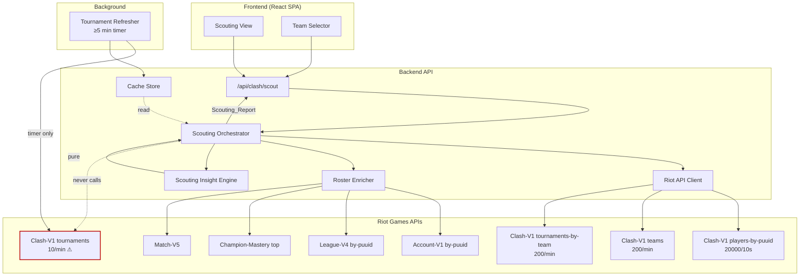
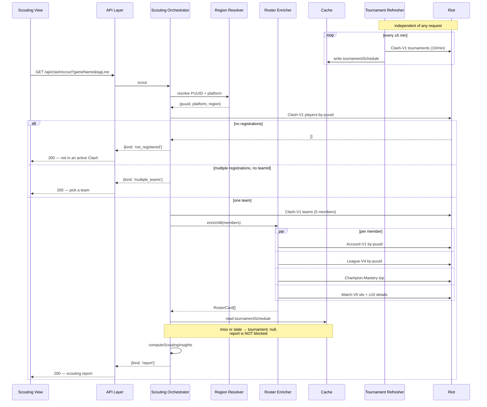

# Design Document

## Overview

A Scouting_Report is a join, like the Live Game lobby, but a deeper and more expensive one. Clash-V1 supplies the skeleton — five PUUIDs, their declared positions, who the captain is, the team's name and tier — and everything that makes it useful is fetched and derived: each member's Riot ID, ranked standing, Champion_Pool from mastery, and a bounded Recent_Form from match history, plus the judgements built on top of those.

Two constraints dominate the design, and both are stated as absolutes rather than as targets.

**Clash-V1's tournaments endpoints are granted 10 requests per minute.** Every other endpoint this application touches is granted between 2,000 and 20,000 per 10 seconds. A limit three orders of magnitude tighter cannot be managed by the Rate_Limit_Manager's usual pre-flight reservation, because at 10/min the reservation would routinely compute a required wait far beyond the 30-second ceiling and fail the request. The only correct answer is to take those endpoints off the request path entirely: a background refresher fetches the Tournament_Schedule on a timer, and visitor requests read the cache or do without. Requirement 4.4's rule — a missing schedule degrades the report rather than blocking it — is what makes that safe.

**Riot does not publish the bracket.** No endpoint answers "who does this team play next". A scouting report is therefore addressed by naming any player on the team to be scouted, which is what a captain actually has: opponent names are visible in champion select and in the post-game lobby. This is a limitation of the API, not of the design, and stating it plainly here prevents a later reading of the spec from assuming a capability that does not exist.

The expensive part is Recent_Form. Five members times a bounded window of matches is the only fan-out in this feature large enough to matter, and it is bounded at 10 matches per member by Requirement 2.4 — a cap chosen so the worst case is 55 Match-V5 calls rather than the 505 an unbounded window over the existing 100-match history (`MATCH_HISTORY_COUNT` in `backend/src/orchestrator/index.ts`) would produce.

## Architecture



Key architectural decisions:

- **The tournaments endpoint is reachable only from the background refresher.** Requirement 4.1 is enforced structurally: the refresher owns the only reference to `getClashTournaments`, and the Scouting Orchestrator is not given one. A property test asserts this rather than trusting the layering, because the failure mode — a visitor request occasionally exhausting a 10/min budget and returning a rate-limit error for a feature that had nothing to do with tournaments — is intermittent and would be diagnosed as a Riot problem.
- **`tournaments-by-team` is on the request path; `tournaments` is not.** They are different endpoints with different limits (200/min against 10/min), and conflating them would either wrongly forbid a cheap call or wrongly permit an expensive one.
- **Recent_Form is bounded at the orchestrator, not at the client.** The cap is a scouting decision (10 recent matches is what "recent form" means here), not a transport concern, so it lives where a reader looks for it.
- **The Scouting Insight Engine is pure and takes the assembled report**, mirroring the existing insight modules in `backend/src/insight/` and the `live-game` Lobby Insight Engine. Requirement 3.1 is then structural rather than a rule to remember.
- **Match details are shared cache.** Recent_Form for five teammates who queue together hits the same `matchDetail` entries repeatedly, and those are already retained indefinitely (`matchDetail: 'infinite'` in `backend/src/cache/index.ts`), since completed match data is immutable. Scouting a five-stack is therefore much cheaper than scouting five strangers, which is the opposite of the usual worst case.

## Components and Interfaces

### Riot API Client (additions)

```typescript
interface RiotApiClient {
  // ... existing methods unchanged ...

  getClashPlayersByPuuid(
    platform: PlatformRoutingValue,
    puuid: string,
  ): Promise<RiotApiResult<ClashPlayerDto[]>>;

  getClashTeam(
    platform: PlatformRoutingValue,
    teamId: string,
  ): Promise<RiotApiResult<ClashTeamDto>>;

  getClashTournamentsByTeam(
    platform: PlatformRoutingValue,
    teamId: string,
  ): Promise<RiotApiResult<ClashTournamentDto[]>>;

  getChampionMasteryTop(
    platform: PlatformRoutingValue,
    puuid: string,
    count: number,
  ): Promise<RiotApiResult<ChampionMasteryDto[]>>;
}

/**
 * Deliberately NOT on RiotApiClient's request-path surface. Granted 10 req/min,
 * which is below what the Rate_Limit_Manager's 30-second ceiling can absorb, so
 * only the Tournament Refresher may hold a reference (Requirement 4.1).
 */
interface ClashTournamentSource {
  getClashTournaments(platform: PlatformRoutingValue): Promise<RiotApiResult<ClashTournamentDto[]>>;
}
```

Splitting `ClashTournamentSource` out of `RiotApiClient` is the mechanism behind Requirement 4.1. The Scouting Orchestrator's dependency type does not include it, so a request-path call to it is a compile error rather than a code-review finding.

### Tournament Refresher

```typescript
interface TournamentRefresher {
  /** Refreshes at most once per interval; writes into the tournamentSchedule cache entry. */
  start(intervalMs: number): void;
  stop(): void;
}
```

Runs on the injected clock and scheduler, as every other timed component in this build does, so tests drive it without real timers. It writes into the Cache_Store rather than holding its own state, which means a cold start with an empty cache degrades exactly as Requirement 4.4 describes instead of behaving differently from a stale one.

### Scouting Orchestrator

```typescript
type ScoutingResult =
  | { kind: 'report'; report: ScoutingReport }
  | { kind: 'multiple_teams'; teams: readonly ClashTeamSummary[] }
  | { kind: 'not_registered' }
  | { kind: 'error'; code: ErrorCode; retriable: boolean };

interface ScoutingOrchestrator {
  scout(
    riotId: { gameName: string; tagLine: string },
    teamId?: string,
  ): Promise<ScoutingResult>;
}
```

The pipeline:

1. Resolve the Riot_ID to a PUUID and Resolved_Platform via the Region_Resolver (Requirement 1.1).
2. `cacheOrFetch` Clash-V1 players-by-puuid. An empty array is `not_registered` — a state, not an error (Requirement 1.3).
3. If more than one registration and no `teamId` was supplied, return `multiple_teams` for the visitor to choose from (Requirement 1.5).
4. `cacheOrFetch` the Clash_Team, then enrich the roster.
5. Read the Tournament_Schedule from cache; on a miss or a stale entry, proceed without it (Requirement 4.4).
6. Run the Scouting Insight Engine over the assembled report.

### Roster Enricher

```typescript
const RECENT_FORM_MATCH_LIMIT = 10;

interface RosterEnricher {
  enrichAll(
    platform: PlatformRoutingValue,
    region: RegionalRoutingValue,
    members: readonly ClashPlayerDto[],
  ): Promise<readonly RosterCard[]>;
}
```

Each member's account, league and mastery calls are wrapped in the `enrich<T>() => T | null` helper from `lookup-pipeline-fixes`. Recent_Form reuses the shape the main lookup already has: an individual match-by-id failure excludes that match and continues (Requirement 2.6), exactly as `backend/src/orchestrator/index.ts` does when assembling a Profile Report — so a scouting report and a profile report degrade the same way, and the behaviour does not have to be learned twice.

### Scouting Insight Engine

Pure functions, no I/O, no clock.

```typescript
const MAX_BAN_RECOMMENDATIONS = 5;

interface ScoutingInsights {
  banRecommendations: readonly BanRecommendation[];   // ≤ 5, strictly ordered
  positionMismatches: readonly PositionMismatch[];
  stackCohesion: number;                              // 0..5
}

interface BanRecommendation {
  championId: number;
  puuid: string;              // whose champion this is
  masteryPoints: number;
  recentGames: number;
  recentWins: number;
}

function computeScoutingInsights(report: ScoutingReport): ScoutingInsights;
```

**The ban order is a total order, declared here so the property test can assert it exactly.** Candidates are every champion appearing in any member's Champion_Pool or Recent_Form. They are ordered by, in strict precedence:

1. recent wins on that champion within the team's combined Recent_Form, descending;
2. mastery points on that champion, descending;
3. recent games played on that champion, descending;
4. champion identifier, ascending.

The final tie-break on champion id is what makes the order total rather than merely a sort — without it, two champions equal on the first three keys would order non-deterministically, and Requirement 3.8's determinism claim would be false.

`positionMismatches` flags a member whose Declared_Position differs from their Observed_Role, skipping members whose declaration is unselected or fill (Requirement 3.5) and members with an empty Recent_Form (Requirement 3.6). Both exclusions exist for the same reason: a mismatch is a claim that a player said one thing and did another, and neither an absent declaration nor an absent history supports that claim.

`stackCohesion` counts how many of the team's members appear together in at least one match across the combined Recent_Form (Requirement 3.7) — a five-stack that queues together reads very differently from five solo players who registered as a team.

### API Layer

```
GET /api/clash/scout?gameName=<name>&tagLine=<tag>&teamId=<id>
```

`200` for `report`, `multiple_teams` and `not_registered` alike — all three are successful outcomes. `teamId` is optional and only meaningful when the player holds more than one registration.

## Data Models

```typescript
interface ScoutingReport {
  team: {
    id: string;
    name: string;
    abbreviation: string;
    tier: number;
    iconId: number;
    captainPuuid: string;
  };
  /** Requirement 4.4 — null when the schedule was absent or stale. */
  tournament: { id: number; nameKey: string; nameKeySecondary: string } | null;
  roster: readonly RosterCard[];
  insights: ScoutingInsights;
}

interface RosterCard {
  puuid: string;
  declaredPosition: 'UNSELECTED' | 'FILL' | 'TOP' | 'JUNGLE' | 'MIDDLE' | 'BOTTOM' | 'UTILITY';
  isCaptain: boolean;
  /** Absent when the corresponding enrichment call failed. */
  riotId: { gameName: string; tagLine: string } | null;
  rankedEntries: readonly RankedQueueStanding[] | null;
  championPool: readonly { championId: number; masteryPoints: number; masteryLevel: number }[] | null;
  /** Bounded at RECENT_FORM_MATCH_LIMIT. Individually-failed matches are excluded. */
  recentForm: readonly RecentFormEntry[];
  /** Null when recentForm is empty (Requirement 3.6). */
  observedRole: string | null;
}
```

### Cache entry TTLs

| Endpoint | TTL | Rationale |
|---|---|---|
| `clashPlayers` | **5 minutes** | Registrations change when a player joins or leaves a team, which happens during a tournament window but not by the second (Requirement 5.2). |
| `clashTeam` | **5 minutes** | Rosters are fixed once a bracket starts; 5 minutes covers the registration period without serving a stale roster into a match (Requirement 5.3). |
| `tournamentSchedule` | **1 hour** | Riot schedules Clash cups weeks ahead. An hour is far tighter than the data's actual rate of change, and the 10/min limit makes anything shorter unwise (Requirement 5.4). |
| `championMasteryTop` | 1 hour | shares the `live-game` mastery retention |
| `account`, `league`, `matchIds`, `matchDetail` | existing | unchanged (Requirement 5.5) |

### Deletion

Requirement 5.6 has the same shape as `live-game`'s Requirement 6.6: the subject appears not only as the keyed player of their own `clashPlayers` entry, but as a roster member inside `clashTeam` entries keyed on a team. The existing `deleteByPuuid` matches entries on their value as well as their key, so both are evicted by the same scan — asserted by Property 5 rather than assumed. Evicting a `clashTeam` entry costs one re-fetch against a 200/min endpoint and is self-correcting within 5 minutes.

## Sequence Flow: Scouting Request



## Rate Limiting

Per cold Scouting_Report, against the granted limits:

| Endpoint | Calls | Granted limit | Reports/s before throttling |
|---|---|---|---|
| Clash-V1 players-by-puuid | 1 | 20,000 / 10s | ~2000 |
| Clash-V1 teams | 1 | 200 / min | ~3.3 |
| Clash-V1 tournaments-by-team | 1 | 200 / min | ~3.3 |
| Account-V1 by-puuid | 5 | 20,000 / 10s | ~400 |
| League-V4 by-puuid | 5 | 20,000 / 10s | ~400 |
| Champion-Mastery top | 5 | 20,000 / 10s | ~400 |
| Match-V5 match-ids | 5 | 2,000 / 10s | ~40 |
| Match-V5 match-by-id | up to 50 | 2,000 / 10s | ~4 |
| **Clash-V1 tournaments** | **0** | **10 / min** | **never on the request path** |

The binding constraints are the two 200/min Clash endpoints and the match-detail fan-out, both landing around 3–4 cold reports per second. The 5-minute team and registration TTLs mean repeated scouting of one team during a bracket window costs one cold assembly and then nothing, and `matchDetail`'s indefinite retention means a five-stack's overlapping games are fetched once between them.

The last row is the point of the table. Clash-V1's tournaments endpoint contributes zero calls per report by construction, not by budget.

## Error Handling

| Trigger | Backend behavior | User-facing result |
|---|---|---|
| Clash-V1 players-by-puuid returns `[]` | Return `not_registered` | "Not registered for an active Clash tournament" — a state, not an error |
| Player holds multiple registrations, no `teamId` | Return `multiple_teams` | Team picker |
| Clash-V1 teams 404 for a registered team id | Treat as `not_registered` | Same state; the registration is stale and the entry is re-fetched on the next request |
| Clash-V1 5xx / timeout / 429 / network | Surface the existing error class | `RIOT_UNAVAILABLE` / `TIMEOUT` / `RATE_LIMITED` / `NETWORK_ERROR` |
| Any roster enrichment call fails | Field becomes `null` on that card | Card renders with that field blank; no error |
| Individual match-by-id in Recent_Form fails | Exclude that match, continue | No user-facing error; a shorter Recent_Form |
| Member has no ranked entry | Not a failure | "Unranked" |
| Member's Recent_Form is empty | Omit Observed_Role; no mismatch flag | Position mismatch simply not claimed |
| `tournamentSchedule` absent or stale | `tournament: null`, report unblocked | Report renders without tournament details |
| Region resolution fails | Inherited from `lookup-pipeline-fixes` | `NO_LOL_ACCOUNT` / `UNSUPPORTED_PLATFORM` / retriable class |

The third row deserves the note. A `clashPlayers` entry can outlive the team it references — a player leaves a team inside the 5-minute TTL and the team id 404s. Treating that as `not_registered` rather than as an error is correct: the visitor's question was "is this player on a Clash team", and the honest current answer is no.

## Correctness Properties

### Property 1: No active Clash registration is a state and never an error

For any PUUID and any Clash-V1 players-by-puuid response, an empty registration array yields `{ kind: 'not_registered' }` with no error code and issues no teams, enrichment or tournament call; and a teams-endpoint `not_found` for a referenced team id yields the same state rather than an error.

**Validates: Requirement 1.3**

### Property 2: The tournaments endpoint is never called on a request path

For any sequence of scouting requests, with any registration and team shapes, and with the Tournament_Schedule cache in any state including absent and stale, the number of Clash-V1 tournaments calls issued is zero, and every request that finds no usable schedule returns a report with `tournament: null` rather than an error or a blocked response.

**Validates: Requirements 4.1, 4.3, 4.4**

### Property 3: Roster enrichment failure degrades a field, never a member or a report

For any Clash_Team and any assignment of outcomes drawn from the full `RiotApiResult` variant set to each enrichment call for each member, the assembled report contains exactly one Roster_Card per team member, in roster order, and is classified `report`. Each card's `riotId`, `rankedEntries` and `championPool` are non-null if and only if the corresponding call succeeded, and `recentForm` contains exactly those matches whose individual retrieval succeeded, never exceeding the 10-match limit.

**Validates: Requirements 2.4, 2.5, 2.6, 2.7**

### Property 4: Scouting insights are pure and follow their defined orders exactly

For any assembled Scouting_Report, `computeScoutingInsights` returns the same result on repeated invocation; `banRecommendations` contains at most 5 entries, drawn only from champions appearing in some member's Champion_Pool or Recent_Form, and is strictly ordered by recent wins descending, then mastery points descending, then recent games descending, then champion id ascending; a member appears in `positionMismatches` if and only if their Declared_Position is neither unselected nor fill, their Recent_Form is non-empty, and their Observed_Role differs from their Declared_Position; and `stackCohesion` equals the number of team members appearing together in at least one match across the combined Recent_Form.

**Validates: Requirements 3.2, 3.3, 3.4, 3.5, 3.6, 3.7, 3.8**

### Property 5: Deletion removes the subject from every Clash entry

For any PUUID `p` and any cache state containing Clash entries in which `p` appears as the keyed player of a registration, as a roster member of a cached team, or both, after `deleteByPuuid(p)` the string `p` appears nowhere in the cache — including in any `clashPlayers` or `clashTeam` entry — and the operation remains idempotent and always answered.

**Validates: Requirement 5.6**

## Testing Strategy

**Property-based testing**: `fast-check`, minimum 100 runs per property, tagged `// Feature: clash-scouting, Property {n}: {property text}`. `RiotApiClient`, `ClashTournamentSource`, `CacheStore` and the scheduler are faked for Properties 1, 2, 3 and 5.

Property 2 is the most important test in this spec and is the reason `ClashTournamentSource` is a separate interface. It is asserted by handing the orchestrator a `ClashTournamentSource` fake that fails the test on any invocation, then generating request sequences across every cache state. The layering already makes the call a compile error; the property makes it a test failure too, because the cost of a regression here is intermittent rate-limit exhaustion diagnosed as a Riot outage.

Property 4 must guard against degenerate coverage. Generators that rarely produce ties would pass without ever exercising the third and fourth tie-break keys, so champion identifiers and mastery values are drawn from small ranges to force collisions, and `fc.assert`'s `examples` pins at least one case tied through to the champion-id tie-break.

**Unit/example tests**:
- Multiple registrations produce a team picker (1.5).
- A `clashTeam` 404 for a referenced team id degrades to `not_registered` (error table row 3).
- Unselected and fill declarations produce no mismatch flag (3.5).
- A member with an empty Recent_Form has no Observed_Role and no mismatch flag (3.6).
- Report renders with `tournament: null` on a cold cache (4.4).
- Tournament Refresher does not refresh more often than its interval, driven with fake timers (4.2).
- Unranked members render as unranked (2.7).
- Attribution present, no ad slots, and no non-Riot-exposed identifiers on the scouting page (6.1, 6.2, 6.3).

**Integration tests** (mocked Riot API): a full report for a five-member roster containing one member whose League-V4 call fails, one whose Recent_Form has two individually-failing matches, one declared FILL, and two members who appear together in the same matches — asserting `200`, five cards in roster order, a bounded ban list, exactly one position mismatch, and the expected `stackCohesion`.

**Out of scope for PBT**: the refresher's timing (a scheduler concern, asserted with fake timers), page layout, and static champion-name rendering, which reuses the `live-game` Static_Data_Provider and is tested there.
