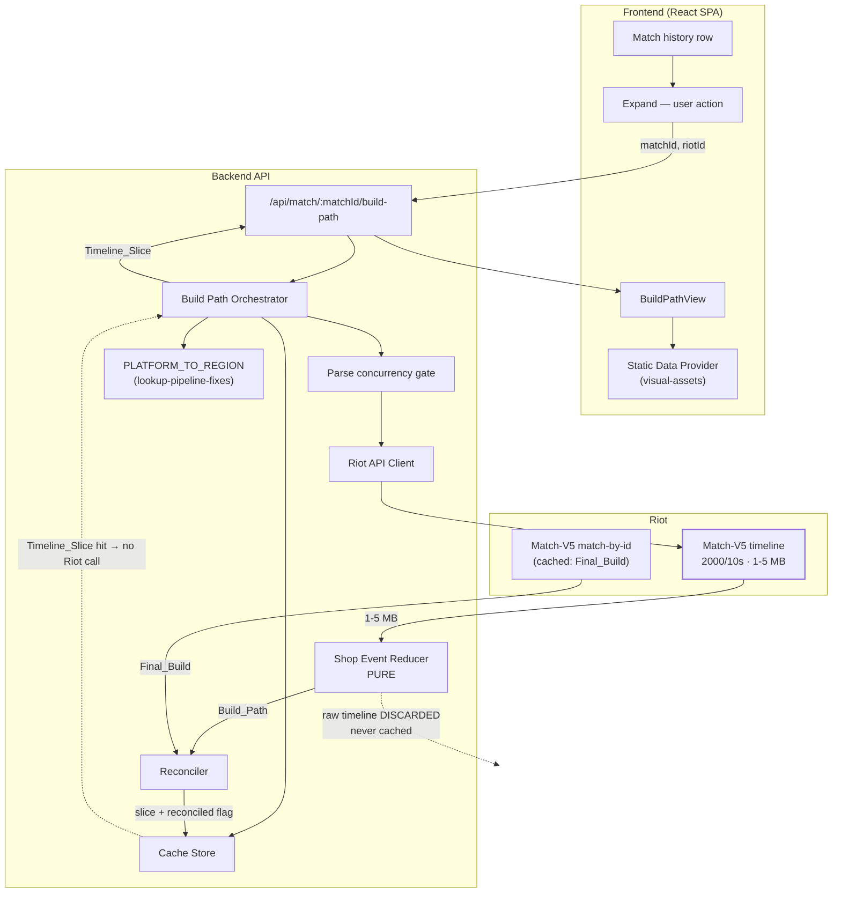
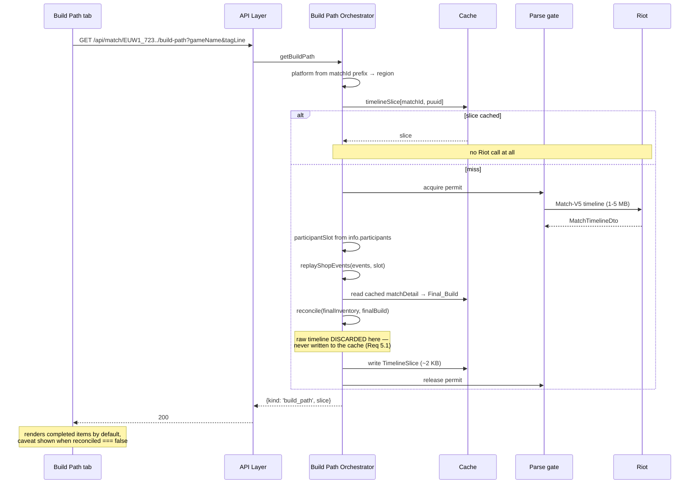

# Design Document

## Overview

One new Riot endpoint, one pure reducer, and a strict rule about what is allowed to be kept.

Match-V5's timeline endpoint returns per-minute frames and a complete event stream for all ten participants. This feature uses one narrow part of it: the four Shop_Events belonging to the analyzed player's Participant_Slot. Everything else in the response — frames, gold, positions, kills, wards, objectives, and nine other players' events — is parsed and thrown away.

That discarding is the central design constraint rather than an optimisation. A timeline response is one to five megabytes of JSON. `InMemoryCacheStore` is an unbounded `Map` with no eviction policy, and `matchDetail` is retained indefinitely on the sound reasoning that a completed match is immutable. A Match_Timeline is immutable by the same argument, so the same reasoning would retain it — and ten opened matches would then hold twenty-odd megabytes forever, per player, growing without bound. The Timeline_Slice is a few kilobytes. Storing the slice and discarding the source keeps the immutability argument intact while removing the memory consequence.

The reducer is the only genuinely difficult piece. A build path is not a filtered list of purchases: players use the shop's undo button constantly, and an undone purchase is not compensated by a matching sell — it emits an `ITEM_UNDO` that reverses it. Filtering purchases yields a build containing items the player never owned, and the result looks entirely plausible. The replay must be a fold over the ordered event stream with undo applied as a reversal of a prior action, not as an event in its own right.

The reconstruction has an independent oracle, which is unusual and worth exploiting. Match-V5's participant record already reports the Final_Build, and `visual-assets` already captures it. Replaying the timeline to game end must produce the same items. The two values come from different endpoints, computed by different means; agreement is real evidence the replay is correct. Rather than assume it, the System computes the comparison on every derivation and carries the result on the payload, so a reconstruction error becomes visible instead of being rendered as fact.

## Architecture



Key architectural decisions:

- **The region comes from the match identifier, not from a resolver call.** A match id is `{PLATFORM}_{gameId}` — `EUW1_7231...` — so the platform is already in hand, and `PLATFORM_TO_REGION` from `lookup-pipeline-fixes` maps it to the regional host the timeline endpoint needs. No Region_Resolver call, no PUUID round trip for routing.
- **The Participant_Slot comes from the timeline's own participant array.** The timeline carries `info.participants: [{ participantId, puuid }]`, which is the authoritative mapping. Confirmed in task 1.1: `metadata.participants` (a `string[]` of PUUIDs) is ordered such that `metadata.participants[i] === info.participants[i].puuid` and `info.participants[i].participantId === i + 1` held exactly on the sampled match — but relying on that ordering would work today and break silently if it ever stopped holding. Requirement 2.5 forbids it; the code reads `info.participants` directly.
- **The reducer is pure, total, and parameterised by Participant_Slot.** It takes an event array and a slot; it has no client, no clock, and no I/O. Requirement 7.1's extensibility clause is satisfied structurally: extracting the lane opponent later means calling it twice with different slots, not changing it.
- **Reconciliation is computed, carried, and never acted upon automatically.** The System does not repair, suppress, or discard an unreconciled Build_Path. It displays it with a caveat and logs the disagreement, because the disagreements are how the unhandled item behaviours get discovered — item transforms and in-place upgrades are the suspected cases, and guessing at them now would encode a guess rather than a finding.
- **Parsing is gated, not just fetching.** Requirement 1.4 bounds concurrent parses because the memory cost of this feature is transient rather than retained: ten simultaneous five-megabyte `JSON.parse` calls is fifty megabytes of short-lived heap, which the rate limiter does nothing to prevent since the limit is 2000 per 10 seconds.

## Components and Interfaces

### Riot API Client (addition)

```typescript
interface RiotApiClient {
  // ... existing methods unchanged ...

  getMatchTimeline(
    region: RegionalRoutingValue,
    matchId: string,
  ): Promise<RiotApiResult<MatchTimelineDto>>;
}

interface MatchTimelineDto {
  metadata: { matchId: string; participants: string[] };
  info: {
    frameInterval: number;
    /** The authoritative Participant_Slot ↔ PUUID mapping (Requirement 2.5). */
    participants: { participantId: number; puuid: string }[];
    frames: { timestamp: number; events: TimelineEventDto[] }[];
  };
}

/** Only the four Shop_Events are modelled; every other event type is ignored. */
type TimelineEventDto =
  | { type: 'ITEM_PURCHASED'; timestamp: number; participantId: number; itemId: number }
  | { type: 'ITEM_SOLD'; timestamp: number; participantId: number; itemId: number }
  | { type: 'ITEM_DESTROYED'; timestamp: number; participantId: number; itemId: number }
  | { type: 'ITEM_UNDO'; timestamp: number; participantId: number; beforeId: number; afterId: number; goldGain: number }
  | { type: string; timestamp: number };
```

`timestamp` on every event is milliseconds from match start (`ITEM_UNDO` samples observed at `892766`, `1551101`, etc.). `ITEM_UNDO` also carries `goldGain` — positive when a purchase is refunded, negative when a sell is walked back — which the reducer does not need but which disambiguates the two cases at a glance during verification.

Frames are typed as carrying only `timestamp` and `events` because `participantFrames` — the gold, experience, and position data — is explicitly out of scope (Requirement 7.2). Modelling it would invite its use.

**Where the types live (implementation note).** `TimelineEventDto` is defined in the pure reducer module (`src/insight/buildPath.ts`), which has no runtime dependencies, and the Riot API Client imports it **type-only**. The reducer is the component that gives the event shape meaning, and this keeps the dependency arrow pointing at the leaf module rather than making the pure reducer import the client. `MatchTimelineDto` lives in the client. `RIOT_METHODS.matchTimeline` is the rate-limit method key.

### Shop Event Reducer

Pure module, no I/O, no clock. The heart of the feature.

```typescript
interface BuildPathEntry {
  itemId: number;
  /** Milliseconds from match start when the item was bought. */
  timestamp: number;
  /** Milliseconds from match start when it was later sold; omitted if never sold. The entry stays in the path. */
  soldAt?: number;
}

interface ReplayResult {
  buildPath: readonly BuildPathEntry[];
  /** Items held at the end of the replay, as a multiset. */
  finalInventory: readonly number[];
}

function replayShopEvents(
  events: readonly TimelineEventDto[],
  participantSlot: number,
): ReplayResult;
```

The fold, in ascending timestamp order, over events belonging to `participantSlot` only:

| Event | Effect on `buildPath` | Effect on inventory |
|---|---|---|
| `ITEM_PURCHASED` | append the acquisition | add the item |
| `ITEM_SOLD` | **unchanged** — it was genuinely acquired | remove one instance |
| `ITEM_DESTROYED` | **unchanged** — it was genuinely acquired | remove one instance |
| `ITEM_UNDO` | **remove** the reversed acquisition, if the reversed action was a purchase | reverse the action |

`ITEM_SOLD` and `ITEM_DESTROYED` deliberately leave the build path alone (Requirements 2.3, 2.4). A component absorbed into a completed item is destroyed, and a starting item sold at the first back was still bought — removing either from the path would erase real history. Only an undo removes an entry, because an undone purchase is the one case where the acquisition did not happen.

**`ITEM_UNDO` polarity — confirmed against real data (task 1.1, 2026-08-27).**

Sampled from `Hide on bush#KR1` (routing `asia`, platform `KR`) across 11 recent solo-queue timelines; `ITEM_UNDO` events observed for several participants, covering undone purchases, undone sells, and stacked/consecutive undos.

An `ITEM_UNDO` describes the inventory transition the undo *causes*, as `beforeId → afterId`:

| Reversed action | `beforeId` | `afterId` | `goldGain` |
|---|---|---|---|
| **Purchase** (item was bought, now removed) | the purchased item id | `0` | positive (refund) |
| **Sell** (item was sold, now restored) | `0` | the sold item id | negative (gold reclaimed) |

Observed examples:
- Undo of purchase: `{ beforeId: 2055, afterId: 0, goldGain: 75 }` following `ITEM_PURCHASED itemId 2055`.
- Undo of purchase: `{ beforeId: 1033, afterId: 0, goldGain: 800 }` — a *stacked* undo; each press emits its own `ITEM_UNDO` naming the specific item that step reverses, so the reducer matches undos to actions by item id rather than by position alone.
- Undo of sell: `{ beforeId: 0, afterId: 1027, goldGain: -210 }` following `ITEM_SOLD itemId 1027`.
- Undo of sell: `{ beforeId: 0, afterId: 2055, goldGain: -30 }` following `ITEM_SOLD itemId 2055`.

**Reducer rule:** an `ITEM_UNDO` with `afterId === 0` reverses the most recent not-yet-reversed `ITEM_PURCHASED` of item `beforeId` for that slot (drop its build-path entry, remove one instance from the inventory). An `ITEM_UNDO` with `beforeId === 0` reverses the most recent not-yet-reversed `ITEM_SOLD` of item `afterId` (re-add one instance to the inventory; the build path was never touched by the sell, so it stays unchanged). Requirement 2.2's behavioural statement holds exactly — the result equals what would have obtained had the reversed action never occurred — and Property 1's two-replay equivalence test needs no rewrite.

### Reconciler

```typescript
interface Reconciliation {
  reconciled: boolean;
  /** Populated only when reconciled is false; drives Requirement 4.4's logging. */
  missingFromReplay?: readonly number[];
  unexpectedInReplay?: readonly number[];
}

function reconcile(
  finalInventory: readonly number[],
  finalBuild: ItemBuild,
): Reconciliation;
```

Compares the replay's end-state against the `ItemBuild` that `visual-assets` already captures from the match detail, as multisets. Consumables and components legitimately do not survive to game end, but they are removed by `ITEM_DESTROYED` events during the replay, so a correct replay's end-state should match the seven reported slots.

Suspected sources of legitimate disagreement — items that transform or upgrade in place without a purchase event — are exactly what Requirement 4.4's logging exists to identify. They are not enumerated here because doing so would be speculation; the mechanism is designed to find them.

**Real-data findings (task 10.1, 2026-08-27).** 13 matches replayed with the real reducer (`Hide on bush#KR1`, 12 Ranked Solo on the live patch, + 1 ARAM). Only **3/13 reconciled**. Every one of the 10 disagreements falls into two classes, and **the build path itself was correct in all of them** — the player genuinely bought each item the replay shows; the mismatch is only against the *final-build snapshot*, which records a later in-place transformation the timeline never emits a purchase for:

1. **Boot upgrades (S15 in-place tier-2 → tier-3).** `3020 Sorcerer's Shoes → 3175 Spellslinger's Shoes`, `→ 3172 Gunmetal Greaves`, `Boots of Swiftness → 3170 Swiftmarch`, `→ 3171 Crimson Lucidity`. The one match with a non-empty `unexpectedInReplay` (`KR_8357486357`: missing `3175`, unexpected `3020`) is the smoking gun — the replay ends holding the tier-2 boot the player bought, the final build shows the tier-3 it became. 8 of 10 disagreements are exactly this.
2. **Trinket / consumable swaps.** `3340 Stealth Ward → 3364 Oracle Lens` (a free swap, no purchase event); `2052 Poro-Snax` and `2421 Shattered Armguard` similarly appear only in the final build. 2 of 10.

No disagreement was a reducer bug: undo handling, sells, destroys and stacked undos all replayed correctly.

**Resolution (revised 2026-08-27, after the caveat proved too noisy in practice).** The build path itself is still never altered — the purchase sequence is what the player did. But `reconcile` now **ignores three item classes on both sides** before comparing, because the game changes them with no `ITEM_PURCHASED` the replay can see:
- **Boots.** An S15 tier-2 boot is `ITEM_DESTROYED` on its in-place upgrade and the tier-3 is never purchased, so the replay ends with *no boot* while the Final_Build reports the tier-3. The boot slot is simply not reconcilable against the end state — the tier-2 purchase is still in the visible build path.
- **Trinkets** (`3340`/`3363`/`3364`) — granted and swapped for free; Farsight/Oracle sometimes emit a 0-gold purchase, sometimes not.
- **Seeker's Armguard** `2420` → `2421` (shield-break transform, observed twice).

`RECONCILE_IGNORED_IDS` in `insight/buildPath.ts` holds the list; it grows only when real-data sampling confirms another in-place transform. Result on the same sample: **13/13 reconcile** (was 3/13). A genuine reconstruction discrepancy — a real reducer bug — still surfaces the caveat (Requirement 4.3) and logs the real item ids both ways (Requirement 4.4). The `unexpectedInReplay: 3020` smoking-gun match reconciles now, as intended.

### Build Path Orchestrator

```typescript
type BuildPathResult =
  | { kind: 'build_path'; slice: TimelineSlice }
  | { kind: 'unavailable'; reason: 'no_timeline' | 'participant_absent' }
  | { kind: 'error'; code: ErrorCode; retriable: boolean };

interface BuildPathOrchestrator {
  getBuildPath(
    matchId: string,
    riotId: { gameName: string; tagLine: string },
  ): Promise<BuildPathResult>;
}
```

1. Derive the platform from the match id prefix, then the region via `PLATFORM_TO_REGION`. An unrecognised prefix is a malformed request → `VALIDATION_FAILED` (400), not a Riot outage.
2. Resolve the Riot_ID to a PUUID through the existing cached account path (`cacheOrFetch` on the `account` endpoint). `not_found` → `PLAYER_NOT_FOUND`.
3. Read the Timeline_Slice from the cache directly (`cache.get`, keyed `{ endpoint: 'timelineSlice', routingValue: region, params: { matchId, puuid } }`). A hit returns without touching Riot (Requirement 5.5). **Not** `cacheOrFetch`: `participant_absent` is a successful-fetch outcome that must not be written as a slice, and `cacheOrFetch` only distinguishes ok/fail. A read that throws degrades to a miss.
4. On a miss: run the timeline fetch **inside** `parseGate.run(...)` (the gate spans fetch+parse), find the Participant_Slot from `info.participants`, replay, reconcile against the `matchDetail`'s `ItemBuild` — read from the cache, **fetched once via `getMatchById` on the rare miss** (someone hitting the endpoint without a prior profile load) rather than returning an unverified `reconciled: false` — then **discard the raw response** and best-effort `cache.set` the slice. `reconciled: false` only when the detail genuinely can't be obtained or has no row for this player.

`impl note:` `errorForFailure` in `orchestrator/buildPath.ts` is the feature-local `RiotApiFailure → { code, retriable }` map (auth→AUTH_FAILURE/false, timeout→TIMEOUT/false, rate_limited→RATE_LIMITED/true, network→NETWORK_ERROR/true, server_error→RIOT_UNAVAILABLE/true). Timeline `not_found` is intercepted before it as `unavailable:no_timeline`.

### API Layer

```
GET /api/match/:matchId/build-path?gameName=<name>&tagLine=<tag>
```

`200` for both `build_path` and `unavailable` — a match without a timeline is a normal outcome, not an error (Requirement 1.5). `GET` because it is a pure read, which also lets the frontend cache it conventionally.

**Response body** (implementation): a discriminated union on `kind`, mirroring the orchestrator's own `BuildPathResult` discriminant so the frontend branches on one field:
- `{ kind: 'build_path'; buildPath: BuildPathEntry[]; reconciled: boolean }` — the slice's `matchId`/`puuid` are not echoed; the caller already has them.
- `{ kind: 'unavailable'; reason: 'no_timeline' | 'participant_absent' }`.
- Errors keep the `{ error: { code, message, retriable, ... } }` envelope every other route uses. `PLAYER_NOT_FOUND` → 404 with the submitted Riot ID echoed; a malformed match-id prefix (orchestrator `VALIDATION_FAILED`) → 400 with a match-id-specific message and `field: 'matchId'` (the code is reused — `'matchId'` was added to `ValidationField`, no new `ErrorCode`); `RATE_LIMITED` → 429 with a `Retry-After` header.

### Frontend: BuildPathView

Rendered inside the **Build Path tab** of the Detail_Panel that `match-detail-tabs` establishes on every match row — replacing that tab's not-yet-available placeholder (its Requirement 5.2). Three consequences follow from that host, and none of them change this design's substance:

- **The trigger is tab selection, not row expansion.** `match-detail-tabs` expands panels with the General tab selected and issues no request for General or Runes. This view is the only surface in the recent-matches section that ever fetches, so Requirement 1.1's prohibition on retrieving timelines during Profile_Report assembly is satisfied structurally rather than by discipline. Implementation: `DetailPanel` mounts only the selected tab's content, so `BuildPathTab`'s mount-time `useEffect` *is* "on selection"; it calls `fetchBuildPath` (frontend `lookupClient.ts`, same never-rejects contract as `lookupProfile`), guarding against a late resolve with a `cancelled` flag.
- **The Riot ID is the one the visitor searched (`report.riotId`), threaded ProfileReportView → MatchRow → DetailPanel → tab — not the match participant's stored `riotIdGameName`.** The stored name can be stale if the player renamed since the match; the searched Riot ID is what the backend already resolves everywhere else.
- **Loading and failure states live inside the tab.** Requirement 3.10. An unavailable timeline (Requirement 6 / 1.5) renders as a message within the tab, not as a page-level error, because the rest of the match row and the other two tabs are unaffected by it.
- **`isCompletedItem` is already there.** `match-detail-tabs` extends the Static_Data_Provider with spell and rune metadata but does not touch item metadata, so the classification accessor this view depends on is unchanged.

**Riot compliance (Requirement 8) is inherited, not re-implemented.** The Build Path tab renders only inside `ProfileReportPage`, which already wraps its content in `RiotDataPage` — so the attribution statement (8.1) and the no-advertising default (8.2) cover the tab with no extra wrapper (a nested `RiotDataPage` would duplicate the masthead). Item images are served as bare ``, unaltered (8.3), exactly as `ItemBuildRow` does.

Item images and the Component_Item classification both come from the `visual-assets` Static_Data_Provider, whose `isCompletedItem` accessor pins the rule. That rule is not the obvious one: `depth` is absent on 520 of `item.json`'s 868 entries including finished items like Doran's Blade, and "has no `into`" wrongly excludes Berserker's Greaves. The verified composite rule lives in `visual-assets`' design, which is why Requirement 3.2's prohibition on a second classification source matters here rather than being a formality.

**Layout (revised 2026-08-27).** The path is drawn as a **left-to-right flow that wraps** onto the next line (no horizontal scroll; a full build is 15–25 nodes). Each acquisition is a node — item icon + `M:SS` time — and the connector line + arrowhead is *leading* (rendered before the item), so the last node of a visual row has no trailing arrow and the first node of the next row keeps its incoming arrow. The **whole sequence shows by default** — consumables, Control Wards and boots included — with an optional "Legendary items only" toggle that collapses to `isCompletedItem` entries (hidden until the metadata index loads). **Purchases and sales are merged into one time-ordered flow.** A sold item appears **twice**: a normal buy node at its buy time, and a separate dimmed **"sold"** marker at `soldAt` (the `ITEM_SOLD` event's own timestamp, recorded on the entry by the reducer). The two moments are never collapsed. The connector is a flex line-plus-arrowhead in a 32 px box so it centres on the icon row it points into. **Trinket nodes bookend the flow**, because the game grants/swaps trinkets with no reliable purchase event: a leading **"start"** node shows the starting trinket — the default yellow Stealth Ward (`3340`) unless the timeline shows a different trinket bought in the first 7 s, which is then taken as the selected one and folded into the start node rather than shown inline; a trailing **"final"** node shows `match.build.trinket` only when it differs from the start (a mid-game swap). Timestamps render as `M:SS` from match start, minutes unwrapped (Requirement 3.4).

**Skill order (`SkillOrderView`, sibling of `BuildPathView` in the tab).** `TimelineSlice.skillOrder` is the `skillSlot` (1=Q, 2=W, 3=E, 4=R) leveled at each level-up, in time order — extracted from the timeline's `SKILL_LEVEL_UP` events by `extractSkillOrder` (pure, alongside the reducer). The view shows four ability tiles (Q/W/E/R) with the champion's spell icons and an ①②③ badge for the order Q/W/E were maxed (5 points), plus a 4-row × N-column grid with the leveled cell filled per level. Spell icons come from Data Dragon's per-champion file (`.../data/en_US/champion/{Key}.json`), fetched straight from the CDN and module-cached; a fetch failure falls back to plain Q/W/E/R letters — the order data never depends on the icons. `championName` (the Riot champion key) is threaded down from `match.championName`.

## Data Models

```typescript
interface TimelineSlice {
  matchId: string;
  puuid: string;
  buildPath: readonly BuildPathEntry[];
  reconciled: boolean;
}
```

That is the entire retained artifact. For a thirty-minute game with fifty shop actions it is on the order of two kilobytes, against a source measured in hundreds of kilobytes to low megabytes — the ratio that makes indefinite retention safe.

**Observed response sizes (task 1.1):** 11 KR solo-queue timelines ranged **0.32 MB (15.6 min)** to **0.95 MB (30.4 min)**, roughly linear in game length. The original "1–5 MB" estimate was conservative for standard Summoner's Rift; the sample contained no 40-plus-minute game and no ARAM (whose far higher shop-event volume would push the top end up), so the parse gate in Requirement 1.4 stays justified even though the typical case is under 1 MB. The retention argument is size-independent regardless: the slice is kilobytes at any source size.

### Cache entry TTL

| Endpoint | TTL | Rationale |
|---|---|---|
| `timelineSlice` | **indefinite** | A completed match's events are immutable, exactly as its detail is (Requirement 5.4). Safe here only because the slice is kilobytes; the same retention on the raw response is what Requirement 5.1 forbids. |

The Match_Timeline itself has **no cache entry type**, by design. There is no `timeline` endpoint in `CacheEndpoint` for a caller to reach for, which makes Requirement 5.1 structural rather than a rule to remember.

### Deletion

`timelineSlice` is keyed on the PUUID, so the existing key scan in `deleteByPuuid` removes it. The slice holds no other participant's identifiers — it describes one player — so there is no value-scan case of the kind `matchDetail` needs. Requirement 5.6 is satisfied by the existing mechanism and asserted by Property 5.

## Sequence Flow: Selecting the Build Path Tab

The trigger is selecting the Build Path tab on an already-expanded match row — not expanding the row, which costs nothing.



## Rate Limiting

| Endpoint | Calls per expanded match | Granted limit |
|---|---|---|
| Match-V5 timeline | 1, or 0 when the slice is cached | 2,000 / 10s |

The rate limit is not the binding constraint and will not become one: a visitor expands match rows one at a time, and each match is fetched once ever. The constraint is transient parse memory, which the Rate_Limit_Manager does not model and cannot relieve — hence the separate parse gate in Requirement 1.4.

## Error Handling

| Trigger | Backend behavior | Visitor sees |
|---|---|---|
| Timeline 404 for a valid match id | Return `unavailable: no_timeline` | Row and Final_Build unchanged; "build path unavailable" |
| Player absent from `info.participants` | Return `unavailable: participant_absent` | Same; no partial path rendered |
| Timeline 5xx / timeout / 429 / network | Surface the existing error class | `RIOT_UNAVAILABLE` / `TIMEOUT` / `RATE_LIMITED` / `NETWORK_ERROR`; row still renders |
| Replay reconciles | Mark `reconciled: true` | Build path, no caveat |
| Replay does not reconcile | Mark `reconciled: false`, log match id and the diff | Build path **with** a caveat that it may be incomplete |
| Shop event references an unknown item id | Keep the acquisition in the path | Placeholder image, raw id as the text alternative |
| Cached match detail unavailable for Reconciliation | Mark `reconciled: false` | Build path with the caveat |

The unreconciled row is the one to get right. Requirement 4.5 forbids discarding or silently correcting the path, because a build path that is 90% right is still useful and a suppressed one teaches nobody anything — while a wrong one presented as certain is the failure this whole reconciliation mechanism exists to prevent.

## Correctness Properties

### Property 1: Undo is equivalent to the action never having occurred

For any sequence of Shop_Events for a single Participant_Slot, replaying the sequence yields the same Build_Path and the same final inventory as replaying the sequence with each undone action and its corresponding undo event both removed. This holds for any number of undos, for undos of purchases and of sells, and for consecutive undos.

**Validates: Requirement 2.2**

### Property 2: Replay reconstructs the reported final build

For any Match_Timeline and the match detail describing the same match and player, the multiset of items produced by replaying the player's Shop_Events to the end of the game equals the multiset of non-zero Item_Slots that the participant record reports as the Final_Build; and whenever the two differ, the result is marked unreconciled and the difference is reported in both directions.

**Validates: Requirements 4.1, 4.2, 4.3**

### Property 3: The build path is ordered, complete, and free of undone acquisitions

For any sequence of Shop_Events, the resulting Build_Path is in non-decreasing timestamp order; contains one entry for every purchase that was not subsequently undone; contains no entry for any purchase that was undone; and retains entries for items that were later sold or destroyed.

**Validates: Requirements 2.1, 2.3, 2.4, 2.7**

### Property 4: Only the analyzed participant's events affect the result

For any Match_Timeline and any Participant_Slot within it, the Build_Path produced is unchanged by arbitrary addition, removal, or modification of Shop_Events belonging to any other Participant_Slot.

**Validates: Requirements 2.5, 2.6, 7.1**

### Property 5: The raw timeline is never retained, and the slice is deletable

For any sequence of Build_Path requests, no cache entry is ever written whose value contains a Match_Timeline frame array or any participant's events; and for any PUUID `p` and any cache state, after `deleteByPuuid(p)` the string `p` appears nowhere in the cache, including in any Timeline_Slice, with the operation remaining idempotent and always answered.

**Validates: Requirements 5.1, 5.2, 5.6**

## Testing Strategy

**Property-based testing**: `fast-check`, minimum 100 runs per property, tagged `// Feature: item-timeline, Property {n}: {property text}`. The reducer is pure, so Properties 1, 3 and 4 need no fakes at all; Property 5 fakes the `CacheStore` and `RiotApiClient`.

Property 1 is the most important test in this specification and the reason the reducer is specified as a fold rather than a filter. It is stated as an equivalence between two replays rather than as an assertion about undo's mechanics, which means it holds regardless of the `beforeId`/`afterId` polarity confirmed in task 1.1 — the test does not have to be rewritten when the field semantics are pinned down.

Property 2 is the cross-endpoint oracle and needs generated *pairs*: a synthetic event stream and the Final_Build it implies, so the property can assert agreement over arbitrary streams rather than over a handful of recorded matches. Generators must produce streams containing sells, destroys and undos, not just purchases, or the property passes on the easy case only.

Property 3's generators must produce interleaved undos rather than trailing ones. An undo of the most recent purchase is the easy case and the one an example set would contain; an undo separated from its target by intervening events on other slots is where a naive implementation fails.

**Unit/example tests**:
- Region derived from a match id prefix, including a lowercase and an unknown platform (1.2).
- Timeline 404 yields `unavailable` rather than an error, and the row still renders its Final_Build (1.5, 6.1).
- Participant absent from `info.participants` yields `unavailable`, never an empty path (6.2).
- Unknown item id retained in the path with a placeholder (6.3).
- Unreconciled path is displayed with a caveat and logged, not suppressed (4.3, 4.4, 4.5).
- Completed-items view is the default and the component toggle reveals the rest (3.3).
- Timestamps render as match-relative `M:SS` (3.4).
- No Build_Path rendered for the lane opponent, whose Final_Build is unchanged (3.5, 3.6).
- Parse gate bounds concurrency, driven with a controllable permit source (1.4).
- Attribution present and no ad slots wherever a Build_Path renders (8.1, 8.2).

**Live verification** (manual, one run, task 1.1): retrieve a real timeline for a known match and record the `ITEM_UNDO` field polarity — which of `beforeId` / `afterId` carries the item being reversed, for an undone purchase and for an undone sell. Confirm `info.participants` carries the slot-to-PUUID mapping. Then replay several real matches and record how many reconcile, since the unreconciled rate against real data is the only honest measure of whether the four modelled event types are sufficient.

**Out of scope**: gold and experience curves, positional data, ward and objective events, and any timeline-derived data for participants other than the analyzed player — all excluded by Requirement 7.2 and none of them reachable through the interfaces this design defines.
