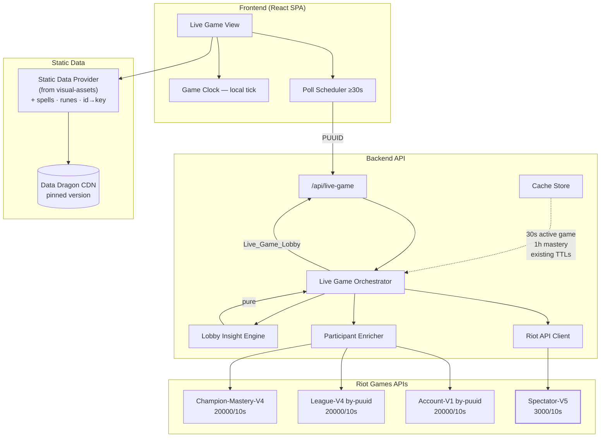
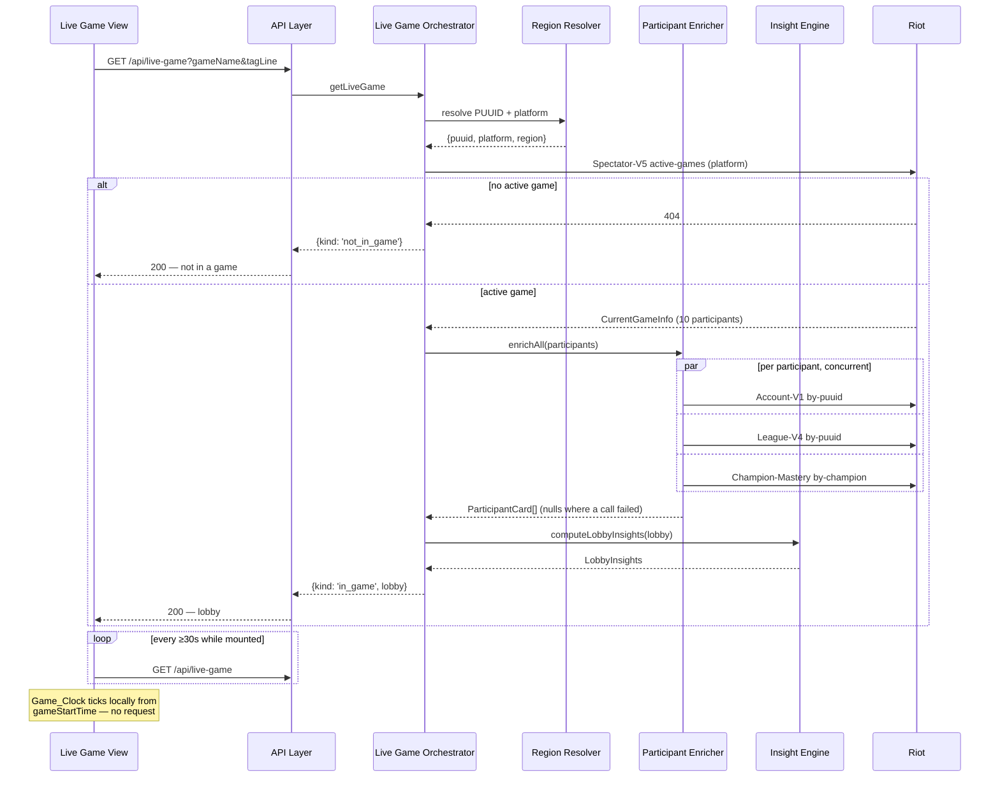

# Design Document

## Overview

The Live Game feature adds one new Riot endpoint and a great deal of joining. Spectator-V5's active-games-by-summoner returns a `CurrentGameInfo` — ten participants identified only by PUUID and champion ID, plus bans, queue, map, and a start timestamp. Everything that makes that readable is fetched separately and joined on: Riot IDs from Account-V1, ranked standing from League-V4, mastery on the locked champion from Champion-Mastery-V4, and champion, spell and rune names from Data Dragon.

Three design pressures follow from that shape.

**The join is wide but cheap.** Ten participants times three enrichment calls is thirty calls per assembled lobby. Every one of those endpoints is granted at 20,000 requests per 10 seconds, so the fan-out costs roughly 1.5 thousandths of the available budget — the enrichment is not the constraint, and does not need to be batched, deferred or sampled. Spectator-V5 itself is granted 3,000 per 10 seconds, which is the tighter of the two and still far above what the feature can generate.

**Live and enriched data go stale at completely different rates.** The active game changes by the second; a player's rank does not change during the game they are in, and their mastery on a champion barely moves in twenty minutes. Caching them at one TTL would either serve a game that ended four minutes ago or re-fetch thirty ranks every poll. They are cached separately, at 30 seconds and at their existing retentions respectively.

**Absence is the common case.** Most players are not in a game most of the time, so Spectator-V5's 404 is the modal response. It is modelled as a state, not a failure — the same way an empty League-V4 entry set already yields `'Unranked'` rather than an error in `backend/src/insight/stats.ts`.

The one genuinely new dependency is Data Dragon. It is a versioned static CDN, not a rate-limited game API, and conflating the two would either put static asset fetches through the Rate_Limit_Manager (wasting reservations against limits Riot does not apply to them) or leave them ungoverned by any retention policy. It gets its own component with its own rules.

## Architecture



Key architectural decisions:

- **The Game_Clock is computed on the client, from the start timestamp.** The backend returns `gameStartTime`; the frontend ticks locally. Requirement 5.1's 30-second poll floor exists to detect the game *ending*, not to advance a clock, and coupling the two would force a poll rate nobody needs. This also makes Requirement 4.4 (never negative) a single clamp in one place rather than a property of every response.
- **The Lobby Insight Engine is pure and takes the assembled lobby.** It is the same shape as the existing insight modules in `backend/src/insight/`: no I/O, no clock, total over its input. Requirement 3.1's prohibition on further API calls is then structural — the function has no client to call one with.
- **Enrichment failures degrade a field, not a card, and never the lobby.** This reuses the `enrich<T>() => T | null` helper introduced by the `lookup-pipeline-fixes` spec rather than inventing a second mechanism, so there is one place in the codebase where "this call's failure is not an error" is expressed.
- **Static data never enters the Rate_Limit_Manager.** Requirement 7.2 is a correctness statement, not an optimisation: reserving slots against Riot's game-API windows for CDN fetches would consume budget the CDN does not police and would make the manager's accounting describe traffic it does not govern.

## Components and Interfaces

### Riot API Client (additions)

```typescript
interface RiotApiClient {
  // ... existing methods unchanged ...

  getActiveGameByPuuid(
    platform: PlatformRoutingValue,
    puuid: string,
  ): Promise<RiotApiResult<CurrentGameInfo>>;

  getAccountByPuuid(
    region: RegionalRoutingValue,
    puuid: string,
  ): Promise<RiotApiResult<AccountDto>>;

  getChampionMastery(
    platform: PlatformRoutingValue,
    puuid: string,
    championId: number,
  ): Promise<RiotApiResult<ChampionMasteryDto>>;
}
```

All three follow the existing contract exactly: rate-limit reservation, 10s timeout, 429 retry, no key leakage (Requirement 1.4). `getActiveGameByPuuid` returning `not_found` is the "not in a game" case and is handled by the orchestrator as a state, not surfaced as an error.

### Live Game Orchestrator

```typescript
type LiveGameResult =
  | { kind: 'in_game'; lobby: LiveGameLobby }
  | { kind: 'not_in_game' }
  | { kind: 'error'; code: ErrorCode; retriable: boolean };

interface LiveGameOrchestrator {
  getLiveGame(riotId: { gameName: string; tagLine: string }): Promise<LiveGameResult>;
}
```

The pipeline:

1. Resolve the Riot_ID to a PUUID and a Resolved_Platform using the Region_Resolver from `lookup-pipeline-fixes` (Requirement 1.5). This is a straight reuse; no region is asked of the visitor.
2. `cacheOrFetch` the active game against the 30-second `activeGame` entry. A `not_found` short-circuits to `not_in_game` and is **not** cached as an absence — caching negative results here would delay the detection of a game starting by up to the TTL, which is the opposite of what a live feature wants.
3. Enrich all participants concurrently. Bot participants are skipped entirely (Requirement 2.5).
4. Run the Lobby Insight Engine over the assembled lobby.

### Participant Enricher

```typescript
interface ParticipantEnricher {
  enrichAll(
    platform: PlatformRoutingValue,
    region: RegionalRoutingValue,
    participants: readonly CurrentGameParticipant[],
  ): Promise<readonly ParticipantCard[]>;
}
```

Each participant's three calls are dispatched concurrently and each is wrapped in `enrich`, so the enricher has no failure mode of its own: it always returns exactly as many cards as it was given participants, with absent fields where a call failed (Requirement 2.4). The fan-out is 30 concurrent calls at worst; the Rate_Limit_Manager serialises them against its windows as it does any other burst.

### Lobby Insight Engine

Pure functions, no I/O, no clock.

```typescript
const OFF_CHAMPION_MASTERY_THRESHOLD = 10_000;
const ONE_TRICK_MASTERY_THRESHOLD = 200_000;

interface LobbyInsights {
  offChampion: readonly string[];   // puuids
  oneTricks: readonly string[];     // puuids
  rankSpread: { highest: RankedTier; lowest: RankedTier } | null;
}

function computeLobbyInsights(lobby: LiveGameLobby): LobbyInsights;
```

`rankSpread` is `null` when fewer than two participants hold a ranked entry in the game's queue (Requirement 3.5) — a spread derived from a single entry is not a spread, and rendering it as one would overstate what is known. The off-champion rule requires that *some* record exists for the participant (Requirement 3.2), so a participant whose enrichment failed entirely is not flagged as being on an unfamiliar champion when the truth is that nothing is known about them.

### Static Data Provider (extension)

The provider itself is defined by the `visual-assets` spec, along with its version pinning, its 24-hour retention, and its exclusion from the Rate_Limit_Manager. This feature adds two accessors it does not have, both forced by Spectator-V5's payload shape:

```typescript
interface StaticDataProvider {
  // ... defined in visual-assets ...

  /** Spectator-V5 reports champions NUMERICALLY; Match-V5 reports a Champion_Key. */
  championKeyForId(championId: number): string | null;

  // The spell and rune accessors below are SHARED with the `match-detail-tabs`
  // feature, whose Requirement 7.8 declares them one extension with two
  // claimants: whichever feature is implemented first provides them, and the
  // second does not reimplement them. Names follow the provider's established
  // `championDisplayName` / `itemDisplayName` convention.
  summonerSpellDisplayName(id: number): string;
  summonerSpellIconUrl(id: number): string | null;
  runeDisplayName(id: number): string;
  runeIconUrl(id: number): string | null;
  runeTreeDisplayName(styleId: number): string;
  runeTreeIconUrl(styleId: number): string | null;
  statShardDisplayName(id: number): string;
  statShardIconUrl(id: number): string | null;
}
```

Rune, rune tree and stat shard **icons** are served from Data_Dragon's *unversioned* path — the versioned path returns 403. That is not a variance from Requirement 7.5's inherited pinning: `visual-assets` Requirement 4 was amended (its criteria 7-9) to record the exception at source, so this feature inherits the amended rule.

`championKeyForId` is the one genuinely new lookup direction, and the only accessor here that `match-detail-tabs` does not also need. `champion.json` already carries the numeric `key` beside each entry, so it needs no additional fetch — only the reverse index built at load time. Every accessor stays total in the provider's existing sense: a URL or `null`, a name or the raw identifier, never an empty string and never a throw (Requirement 7.4).

### API Layer

```
GET /api/live-game?gameName=<name>&tagLine=<tag>
```

`200` with `{ kind: 'in_game', lobby }` or `{ kind: 'not_in_game' }` — both are successful outcomes. Error codes reuse the existing table. `GET` rather than `POST` because the request is a pure read with no body, which also lets the frontend's poll be a plain conditional fetch.

## Data Models

```typescript
interface LiveGameLobby {
  gameId: number;
  platformId: string;
  /** Requirement 5.3 — the match id the finished game will be published under. */
  matchId: string;                 // `${platformId}_${gameId}`
  queueId: number;
  mapId: number;
  /** Epoch ms. Zero or absent means Pre_Game (Requirement 4.2). */
  gameStartTime: number | null;
  bannedChampionIds: readonly number[];
  participants: readonly ParticipantCard[];
  insights: LobbyInsights;
}

interface ParticipantCard {
  puuid: string;
  teamId: number;
  championId: number;
  spell1Id: number;
  spell2Id: number;
  perkIds: readonly number[];
  isBot: boolean;
  /** Absent when enrichment failed or the participant is a bot. */
  riotId: { gameName: string; tagLine: string } | null;
  rankedEntries: readonly RankedQueueStanding[] | null;
  championMasteryPoints: number | null;
  championMasteryLevel: number | null;
}
```

`matchId` is derived rather than fetched: Riot publishes a finished game under `{platformId}_{gameId}`, which is exactly the pair Spectator-V5 already returned. Requirement 5.3 is therefore satisfied without a further call.

### Cache entry TTLs

| Endpoint | TTL | Rationale |
|---|---|---|
| `activeGame` | **30 seconds** | Bounds how stale a displayed lobby can be, and matches the poll floor so a poll is never answered entirely from cache (Requirement 6.2). Negative results are not cached. |
| `championMastery` | **1 hour** | Mastery moves by a few thousand points per game; an hour is invisible at the thresholds this feature tests against (Requirement 6.4). |
| `account` (by-puuid) | 1 hour | reuses the `account` entry type already in `backend/src/cache/index.ts` |
| `league` | 10 minutes | reuses the existing `league` entry type — a participant's rank cannot change during the game they are in |
| static data | 24 hours minimum | not a Cache_Store entry; held by the Static_Data_Provider against a pinned version (Requirement 7.4) |

### Deletion

`activeGame` is keyed on the PUUID, so the existing key scan removes the subject's own entry. The harder case is Requirement 6.6: the subject appears as a *participant* inside nine other players' cached `activeGame` entries. The existing `deleteByPuuid` already matches entries on their value as well as their key — which is how `matchDetail` eviction works — so an `activeGame` entry containing the PUUID anywhere is evicted by the same scan. This must be asserted rather than assumed, which is what Property 5 is for. The cost is bounded and self-correcting: an evicted lobby is re-fetched within 30 seconds.

## Sequence Flow: Live Game Request



## Rate Limiting

Per assembled lobby, against the granted limits:

| Endpoint | Calls | Granted limit | Lobbies/s before throttling |
|---|---|---|---|
| Spectator-V5 active-games | 1 | 3,000 / 10s · 180,000 / 10min | ~300 |
| Account-V1 by-puuid | 10 | 20,000 / 10s | ~200 |
| League-V4 by-puuid | 10 | 20,000 / 10s | ~200 |
| Champion-Mastery-V4 by-champion | 10 | 20,000 / 10s | ~200 |

The binding constraint is the enrichment fan-out at roughly 200 cold lobbies per second, which is far beyond what this application will generate, and the 30-second `activeGame` TTL plus the 10-minute `league` TTL mean a followed game costs close to nothing after its first assembly. No batching, sampling or deferral is warranted, and adding any would be speculative complexity.

Data Dragon is deliberately absent from this table. It is not rate-limited by Riot and is not routed through the Rate_Limit_Manager (Requirement 7.2).

## Error Handling

| Trigger | Backend behavior | User-facing result |
|---|---|---|
| Spectator-V5 404 | Return `not_in_game`; do not cache the absence | "Not currently in a game" — a state, not an error |
| Spectator-V5 5xx / timeout / 429 / network | Surface the existing error class | `RIOT_UNAVAILABLE` / `TIMEOUT` / `RATE_LIMITED` / `NETWORK_ERROR` |
| Any Participant_Enrichment call fails | Field becomes `null` on that card | Card renders with that field blank; no error |
| Participant is a bot | Skip all enrichment for it | Card renders as a bot |
| Participant has no ranked entry | Not a failure | "Unranked" |
| Static data identifier unresolvable | Fall back to the raw identifier | Number rendered in place of a name |
| Game ends between polls | Previous lobby was displayed, now 404 | Game-ended state with a link to `{platformId}_{gameId}` |
| Finished match requested before Riot publishes it | Match-V5 404 for a match id that will exist | "Results not yet available" — not an error |
| Region resolution fails | Inherited from `lookup-pipeline-fixes` | `NO_LOL_ACCOUNT` / `UNSUPPORTED_PLATFORM` / retriable class |

The last two rows are the ones most likely to be got wrong. A 404 from Match-V5 for a match id derived from an ended live game is *expected* for a window after the game ends, and rendering it as "match not found" would tell the visitor something false about a game they just watched.

## Correctness Properties

### Property 1: Not-in-game is a state and never an error

For any PUUID and any sequence of Spectator-V5 responses, a `not_found` response yields `{ kind: 'not_in_game' }` with no error code, issues no Participant_Enrichment call, and writes no negative entry to the `activeGame` cache — so an immediately following request re-queries Riot rather than being answered from a cached absence.

**Validates: Requirements 1.2, 6.2**

### Property 2: Enrichment failure degrades a field, never a card or a lobby

For any active game with any number of participants, and for any assignment of outcomes drawn from the full `RiotApiResult` variant set to each of the three enrichment calls for each participant, the assembled lobby contains exactly one Participant_Card per returned participant, in the order returned, and the lobby is classified `in_game`. Each card's `riotId`, `rankedEntries` and `championMasteryPoints` are non-null if and only if the corresponding call succeeded.

**Validates: Requirements 2.4, 2.5, 2.6**

### Property 3: Game clock is derived and never negative

For any start timestamp and any current time, the displayed Game_Clock equals `max(0, now - gameStartTime)`; and for any Live_Game whose start timestamp is absent or zero, the lobby renders as Pre_Game with no Game_Clock displayed.

**Validates: Requirements 4.1, 4.2, 4.4**

### Property 4: Lobby insights are pure and match their defined conditions exactly

For any assembled Live_Game_Lobby, `computeLobbyInsights` returns the same result on repeated invocation; a participant appears in `offChampion` if and only if their locked-champion mastery is below 10,000 and at least one ranked or mastery record exists for them; a participant appears in `oneTricks` if and only if that mastery is at or above 200,000; and `rankSpread` is non-null if and only if at least two participants hold a ranked entry in the game's queue, in which case its `highest` and `lowest` are the extremes of those entries' tiers.

**Validates: Requirements 3.2, 3.3, 3.4, 3.5, 3.6**

### Property 5: Deletion removes the subject from every cached lobby

For any PUUID `p` and any cache state containing `activeGame` entries in which `p` appears as the keyed player, as a participant of another player's game, or both, after `deleteByPuuid(p)` the string `p` appears nowhere in the cache — including in any `activeGame` or `championMastery` entry — and the operation remains idempotent and always answered.

**Validates: Requirements 6.5, 6.6**

## Testing Strategy

**Property-based testing**: `fast-check`, minimum 100 runs per property, tagged `// Feature: live-game, Property {n}: {property text}`. `RiotApiClient` and `CacheStore` are faked for Properties 1, 2 and 5.

Property 2 is the load-bearing one and needs a generator rather than examples: it quantifies over every combination of three independent failure modes across ten participants, a space no hand-written example set covers, and the regression it guards — one enrichment failure collapsing the lobby — is the most likely way this feature breaks in production.

Property 4 must guard against degenerate coverage. A generator that rarely produces mastery values near 10,000 or 200,000 would pass without ever testing a threshold, so the arbitraries are biased toward the boundaries and `fc.assert`'s `examples` pins both thresholds and their off-by-one neighbours explicitly.

**Unit/example tests**:
- Pre_Game rendering for a zero and an absent start timestamp (4.2).
- Bot participants render without enrichment attempts (2.5).
- Unranked participants render as unranked rather than as a failure (2.6).
- Game-ended state and the derived `{platformId}_{gameId}` link (5.2, 5.3).
- "Results not yet available" for a Match-V5 404 on a just-ended game (5.4).
- Static data fallback to the raw identifier (7.5).
- Attribution present and no ad slots on the live game page (8.1, 8.2).
- Poll stops on unmount (5.5).

**Integration tests** (mocked Riot API): a full lobby assembly with a mixed lobby — one bot, one unranked participant, one participant whose League-V4 call fails, one one-trick and one off-champion — asserting a `200`, ten cards, and the expected insight set.

**Out of scope for PBT**: the poll interval itself (a scheduler concern, asserted with fake timers), Data Dragon retrieval (a CDN fetch, asserted with an example), and page layout.
