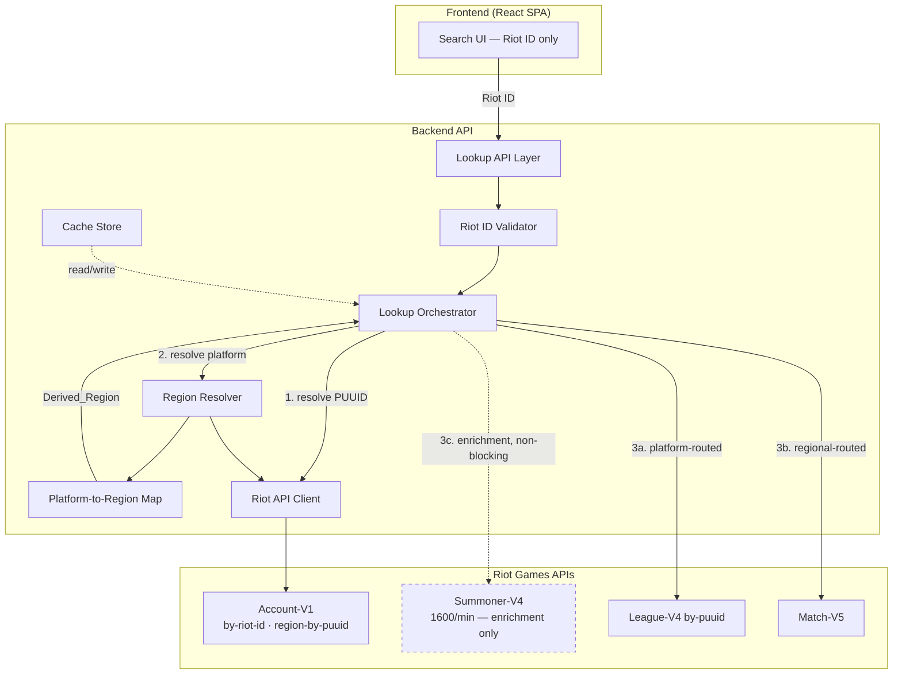
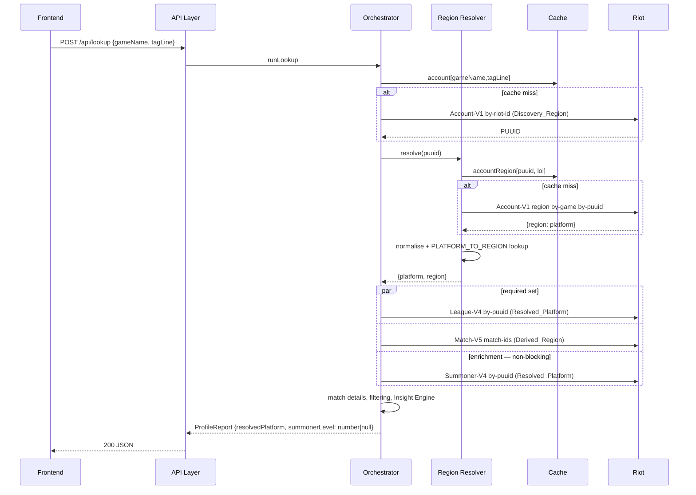

# Design Document

## Overview

Two changes to the existing lookup pipeline, specified together because the second depends on the first.

**The platform stops being a guess.** Today the visitor picks a Regional_Routing_Value, `resolvePlatform` turns it into a Platform_Routing_Value, and Summoner-V4 is called there. Because Account-V1's get-by-riot-id is global, this pairing succeeds at step one and fails at step two whenever the guess was wrong — which is how a correct Riot ID on the wrong dropdown value produces a 404. Account-V1's region-by-game-by-puuid endpoint answers the question directly, so the platform becomes an observation. The dropdown disappears, and the `PLAYER_NOT_ON_PLATFORM` error becomes unreachable rather than merely well-handled.

**Summoner-V4 leaves the critical path.** With the new API grant, Summoner-V4 is capped at 1600 requests/minute (≈26.7/s) while Account-V1, League-V4 get-by-puuid and Champion-Mastery-V4 are capped at 20,000/10s (2000/s). Summoner-V4 is now the pipeline's tightest constraint by roughly two orders of magnitude, and it supplies only `summonerLevel` and `profileIconId`. It is demoted to an Enrichment_Call whose failure yields two null fields instead of an error page.

The ordering between the two is a real dependency, not a preference. `PLAYER_NOT_ON_PLATFORM` is currently *detected* by a Summoner-V4 404 — that call is the sensor for the wrong-region condition. Demoting Summoner-V4 before platform resolution exists would delete the sensor and leave wrong-region lookups silently returning an empty report. Once the platform is resolved from Account-V1, the condition it detected can no longer occur, and the sensor is free to be removed.

## Architecture



Key architectural decisions:

- **Resolution is sequential and cannot be parallelised away.** Every platform-routed and regional-routed call depends on the Resolved_Platform, which depends on the PUUID. The pipeline gains one round trip in the fresh path. That cost is bounded by the existing 10s per-call timeout, is inside the 15s fresh-path budget, and is paid at most once per PUUID per 24 hours because the answer is cached (Requirement 6).
- **The Discovery_Region is a configuration value, not a visitor input.** Both Account-V1 calls are global in effect, so any regional host answers them. A single configured host keeps the code honest about the fact that this value carries no routing meaning.
- **The reverse map is derived, never hand-written.** Requirement 3.2 forbids two independently editable mappings. `PLATFORM_TO_REGION` is computed from `REGION_TO_PLATFORMS` at module load, so the two cannot drift and the existing Property 3 guarantee (disjointness) is what makes the derivation well-defined.
- **Enrichment is structurally separate from the required set.** Rather than special-casing Summoner-V4 inside the existing failure handling, the orchestrator gains an explicit notion of a call whose result is `T | null`. This makes Requirement 4.5 — that no error code or routing decision derives from the call — checkable by inspection rather than by reading every branch.

## Components and Interfaces

### Platform-to-Region Map

Pure module, no I/O. Derived from the existing `REGION_TO_PLATFORMS` at load time.

```typescript
/**
 * Built by inverting REGION_TO_PLATFORMS. That mapping's platform lists are
 * pairwise disjoint — asserted by the existing region property test in
 * backend/src/region/index.property.test.ts — which is exactly the condition
 * under which this inversion is a function rather than a relation. If that
 * disjointness is ever weakened, this derivation silently stops being total.
 */
const PLATFORM_TO_REGION: Readonly<Record<PlatformRoutingValue, RegionalRoutingValue>>;

function regionForPlatform(platform: PlatformRoutingValue): RegionalRoutingValue;
function isSupportedPlatform(value: string): value is PlatformRoutingValue;
function normalisePlatform(raw: string): string;
```

`normalisePlatform` lowercases and trims. Account-V1's region endpoint is documented to return a platform identifier; its exact casing is **not verified against the live API in this document** and must be confirmed during task 1.1 before the normalisation is relied upon. If Riot returns `NA1` and `REGION_TO_PLATFORMS` holds `na1`, normalisation is what bridges them (Requirement 3.4); if the casing already matches, normalisation is a no-op and costs nothing.

### Region Resolver

```typescript
type RegionResolution =
  | { kind: 'resolved'; platform: PlatformRoutingValue; region: RegionalRoutingValue }
  | { kind: 'no_lol_account' }
  | { kind: 'unsupported_platform'; platform: string }
  | { kind: 'failed'; cause: RiotApiResult<never> };

interface RegionResolver {
  resolve(puuid: string): Promise<RegionResolution>;
}
```

`resolve` goes through `cacheOrFetch` against the new `accountRegion` cache endpoint, so a cached resolution never reaches the Riot API client (Requirement 6.3). The four outcomes map one-to-one onto Requirement 5's criteria, which is what keeps the orchestrator's handling exhaustive: `no_lol_account` is Riot answering "this account has never played League", `unsupported_platform` is Riot naming a shard this build does not know, and `failed` carries the underlying `RiotApiResult` so the Error Handling table below maps it without a second translation layer.

### Riot API Client (additions)

```typescript
interface RiotApiClient {
  // ... existing methods unchanged ...

  /** Account-V1 region-by-game-by-puuid. Issued against the Discovery_Region host. */
  getRegionByPuuid(
    region: RegionalRoutingValue,
    game: 'lol',
    puuid: string,
  ): Promise<RiotApiResult<AccountRegionDto>>;
}

interface AccountRegionDto {
  puuid: string;
  game: string;
  region: string;
}
```

The method reserves a rate-limit slot, applies the 10s timeout and honours the 429 retry policy exactly as every other method does (Requirement 1.6) — it is a new endpoint, not a new transport path.

### Lookup Orchestrator (changes)

The `LookupInput` loses its region and gains an optional diagnostic override:

```typescript
interface LookupInput {
  riotId: { gameName: string; tagLine: string };
  /** Requirement 2.4 — diagnostic only, absent from the default UI. */
  platformOverride?: PlatformRoutingValue;
}
```

The pipeline becomes:

1. `validateRiotId` — unchanged.
2. Account-V1 get-by-riot-id on the Discovery_Region → PUUID. A not-found here still halts with `PLAYER_NOT_FOUND` (Requirement 5.1).
3. `regionResolver.resolve(puuid)` → Resolved_Platform + Derived_Region, unless `platformOverride` was supplied, in which case the override is used and `usedPlatformOverride` is set on the report.
4. Fan out: League-V4 and Match-V5 match-ids **in the required set**; Summoner-V4 **as enrichment**.
5. Match details, queue filtering, Insight Engine, `lastUpdated` — unchanged.

Step 4's split is expressed in the type system rather than in control flow:

```typescript
/**
 * An Enrichment_Call resolves to null on every failure class. It has no error
 * channel, which is what makes Requirement 4.5 checkable: there is no value a
 * caller could branch on to halt the pipeline.
 */
async function enrich<T>(fetch: () => Promise<RiotApiResult<T>>): Promise<T | null>;
```

### API Layer (changes)

`POST /api/lookup` accepts `{ gameName, tagLine, platformOverride? }` and no longer accepts `region` or `platform`. The `ProfileReport` gains:

```typescript
interface ProfileReport {
  // ... existing fields unchanged ...

  /** Requirement 2.3 — the platform the data actually came from. */
  resolvedPlatform: PlatformRoutingValue;
  /** Requirement 2.4 — true when criterion 2.4's override bypassed the resolver. */
  usedPlatformOverride: boolean;
  /** Requirement 4.2 — null when the Summoner-V4 enrichment call failed. */
  summonerLevel: number | null;
  profileIconId: number | null;
}
```

`summonerLevel` and `profileIconId` change from required to nullable. This is a breaking change to the response contract and is handled in task 5.2 by updating the frontend types in the same wave.

## Data Models

### New cache entry type

```typescript
type CacheEndpoint =
  | 'account'
  | 'accountRegion'   // new
  | 'summoner'
  | 'league'
  | 'matchIds'
  | 'matchDetail';
```

### Cache entry TTLs

| Endpoint | TTL | Rationale |
|---|---|---|
| `account` | 1 hour | unchanged |
| `accountRegion` | **24 hours** | A player's shard changes only on a paid region transfer. 24h bounds the staleness of a rare event while removing the call from essentially every repeat lookup (Requirement 6.2). |
| `summoner` | 1 hour | unchanged |
| `league` | 10 minutes | unchanged |
| `matchIds` | 10 minutes | unchanged |
| `matchDetail` | indefinite | unchanged |

The `accountRegion` key is `{ puuid, game }` (Requirement 6.1). Including `game` keeps the key honest about the endpoint's shape — the same PUUID has a separate answer for TFT — even though this build only ever passes `lol`.

Deletion (`deleteByPuuid`) already removes every entry in which the PUUID appears in a key parameter. `accountRegion` is keyed on the PUUID, so it is matched by the existing key scan and Requirement 6.4 is satisfied without new deletion logic — but the deletion property test must be extended to cover the new endpoint so this stays true rather than being true by accident.

## Sequence Flow: Lookup Session (revised)



The enrichment branch is drawn inside the `par` because it is dispatched with the others (Requirement 4.4), but the orchestrator does not await it as a precondition for assembling the report — it awaits it only to fill two fields, and a rejection there resolves to `null`.

## Rate Limiting

The revised pipeline's per-lookup call budget, against the granted limits:

| Endpoint | Calls per fresh lookup | Granted limit | Effective ceiling |
|---|---|---|---|
| Account-V1 by-riot-id | 1 | 20,000 / 10s | ~2000 lookups/s |
| Account-V1 region by-puuid | 1 (0 when cached) | 20,000 / 10s | ~2000 lookups/s |
| League-V4 by-puuid | 1 | 20,000 / 10s | ~2000 lookups/s |
| Match-V5 match-ids | 1 | 2,000 / 10s | ~200 lookups/s |
| Match-V5 match-by-id | up to 20 | 2,000 / 10s | ~10 lookups/s cold |
| Summoner-V4 | 1 (enrichment) | **1,600 / min** | ~26 lookups/s |

Before this change, Summoner-V4's 26/s ceiling gated every lookup and a breach produced an error page. After it, the binding constraint on the required set is Match-V5's match-by-id fan-out, and a Summoner-V4 breach costs two cosmetic fields. The Rate_Limit_Manager's behaviour is unchanged: the enrichment call still reserves a slot, and `RateLimitExceededError` on that call is caught by `enrich` and becomes `null` rather than propagating.

## Error Handling

The complete error table for the revised lookup pipeline. Rows marked **new** or **changed** differ from what the application ships today; the rest are stated in full so this document is the whole picture rather than a diff. The implementation lives in `backend/src/api/errors.ts`.

| Trigger | Backend behavior | User-facing result | |
|---|---|---|---|
| Validation failure | Reject before any Riot call | `VALIDATION_FAILED` with rule-specific code, no retry needed | |
| Account-V1 by-riot-id 404 | Stop pipeline, no resolver call | `PLAYER_NOT_FOUND` with gameName/tagLine echoed | |
| Region resolver reports no LoL region | Stop pipeline before any platform-routed call | `NO_LOL_ACCOUNT`, 404, retriable=false, stating the Riot account exists but has no League play history | **new** |
| Region resolver returns an unknown platform | Stop pipeline | `UNSUPPORTED_PLATFORM`, 404, retriable=false, naming the platform returned | **new** |
| Region resolver 5xx / timeout / 429 / network | Stop pipeline, **no guessed fallback** | `RIOT_UNAVAILABLE` / `TIMEOUT` / `RATE_LIMITED` / `NETWORK_ERROR` | **new** |
| Summoner-V4 any failure, 404 included | Fill `summonerLevel` and `profileIconId` with `null`, continue | **no user-facing error** | **changed** |
| ~~Summoner-V4 404 after PUUID resolved~~ | ~~Stop pipeline~~ | ~~`PLAYER_NOT_ON_PLATFORM`~~ | **removed** |
| League-V4 or Match-V5 match-ids failure | Stop pipeline for this PUUID | `RIOT_UNAVAILABLE` / `MATCH_HISTORY_UNAVAILABLE` | |
| Any Riot endpoint 500/502/503/504 | Surface as retriable | `RIOT_UNAVAILABLE`, retriable=true, capped at 3 explicit retries per session | |
| Any Riot call exceeds 10s | Abort in-flight request | `TIMEOUT` | |
| Riot 401/403 | Log server-side, never forward details | `AUTH_FAILURE` (generic "service unavailable") | |
| Riot 429 after retries exhausted | Client enforces ≥5s cooldown before re-enabling retry | `RATE_LIMITED`, retriable=true after cooldown | |
| Network error, no HTTP response | Distinguish from timeout | `NETWORK_ERROR`, retriable=true | |
| Individual match-by-id failure | Exclude match, continue loop | no user-facing error; contributes to the limited-data notice | |
| Fresh call exceeds the 15s overall budget | Cancel remaining wait, use last-known cache | success with `partialDataWarning: true` | |

Requirement 5.3's prohibition on a guessed fallback is deliberate and worth stating plainly: falling back to `resolvePlatform(defaultRegion, undefined)` when the resolver is briefly unavailable would reintroduce exactly the wrong-region 404 this change exists to remove, but intermittently — which is strictly worse than failing, because it would be diagnosed as a Riot outage rather than as a bug here.

## Correctness Properties

### Property 1: Platform-to-region mapping is the exact inverse of the region-to-platform mapping

For every Regional_Routing_Value `r` and every platform `p` in `REGION_TO_PLATFORMS[r]`, `regionForPlatform(p) === r`; and for every platform `p` accepted by `isSupportedPlatform`, `p` appears in `REGION_TO_PLATFORMS[regionForPlatform(p)]`. The two mappings have the same platform domain, and `regionForPlatform` is total over it.

**Validates: Requirements 3.1, 3.2**

### Property 2: Resolved platform determines all downstream routing

For any Lookup_Session in which the Region_Resolver returns `resolved`, every platform-routed call issued afterwards carries the Resolved_Platform, and every regional-routed call issued afterwards carries `regionForPlatform(Resolved_Platform)` — for all inputs, including sessions in which a `platformOverride` was absent and sessions in which the visitor's historical region value would have differed.

**Validates: Requirements 1.2, 1.3, 1.4**

### Property 3: Summoner-V4 outcome never changes lookup classification

For any Lookup_Session and any Summoner-V4 outcome drawn from the full `RiotApiResult` variant set, including `not_found`, the classification of the session's result — success versus error, and the error code when it is an error — is identical to the classification the same session produces when Summoner-V4 succeeds. The only observable difference is that `summonerLevel` and `profileIconId` are `null`.

**Validates: Requirements 4.1, 4.2, 4.5**

### Property 4: Region resolution is cached and a cache hit issues no resolver call

For any sequence of Lookup_Sessions for the same PUUID within the `accountRegion` TTL, exactly one region-by-game-by-puuid call is issued, and every session in the sequence routes to the same Resolved_Platform. For any sequence spanning the TTL boundary, a session after the boundary issues exactly one further call.

**Validates: Requirements 6.2, 6.3**

### Property 5: Deletion removes the region-resolution entry

For any PUUID `p` and any cache state, after `deleteByPuuid(p)` the string `p` appears nowhere in the cache, including in the key or value of any `accountRegion` entry, and the operation remains idempotent and always answered.

**Validates: Requirement 6.4**

## Testing Strategy

**Property-based testing**: `fast-check`, minimum 100 runs per property, tagged `// Feature: lookup-pipeline-fixes, Property {n}: {property text}`. `RiotApiClient` and `CacheStore` are faked for Properties 2, 3, 4 and 5 so the orchestration properties stay deterministic and fast.

Property 3 is the one that most needs a generator rather than examples: it quantifies over the entire `RiotApiResult` variant set crossed with otherwise-arbitrary session shapes, and the regression it guards against — someone reintroducing a branch on the summoner result — is exactly the kind that a hand-picked example set misses.

**Unit/example tests**:
- Platform normalisation against both casings Riot might return (3.4).
- `UNSUPPORTED_PLATFORM` message names the offending platform (3.3).
- `NO_LOL_ACCOUNT` message content and status (5.2).
- Resolver failure does not fall back to a guessed platform (5.3) — asserted by verifying no platform-routed call is issued at all.
- Absence of the region and platform selectors from the search interface (2.2).
- Neutral placeholder rendering for null `summonerLevel` / `profileIconId` (4.3).
- Displayed `resolvedPlatform` on the report (2.3).

**Integration tests** (mocked Riot API): the full revised sequence for a player whose Resolved_Platform belongs to a different region than the historical `americas` default — the exact case that produced Finding A — asserting a 200 with a complete report.

**Live verification** (task 1.1, run against the live API with a real key and a real PUUID for `Doffy#Smile` on `europe`):

```
GET https://europe.api.riotgames.com/riot/account/v1/region/by-game/lol/by-puuid/{puuid}
-> 200 {"puuid":"...","region":"euw1","game":"lol"}
```

| Assumption | Result |
|---|---|
| Response shape | **Confirmed** — `{ puuid, game, region }`, matching `AccountRegionDto` exactly as specified above. No field rename needed. |
| Casing of `region` | **Confirmed lowercase** — `"euw1"`, identical casing to `PlatformRoutingValue` and `REGION_TO_PLATFORMS`'s entries. `normalisePlatform`'s lowercasing is therefore defensive rather than load-bearing for this account; it is kept anyway per Requirement 3.4's "confirm both casings" framing, since one observation does not prove Riot never returns uppercase for some other shard or historical account. |
| Behavior for a Riot account with no League play history | **Not verified.** No such account was available to test against during this session. What *was* tested: a syntactically malformed PUUID (wrong length) returns `400 {"status":{"message":"Bad Request - Exception decrypting <value>","status_code":400}}` — this is Riot rejecting an invalid PUUID encoding, a different condition from "valid PUUID, no `lol` region record." The `NO_LOL_ACCOUNT` mapping in the Error Handling table above is therefore **still an assumption**: it is written expecting a `404` for this condition (consistent with how Riot's other by-puuid endpoints report "no record for this game"), but that specific response has not been observed. Task 4.1's implementation should treat any `404` from this endpoint as `no_lol_account` per the design above, and this note should be replaced with a confirmed observation the first time a real no-League account is available to test against — until then, the 404 branch is unverified in practice, not unreasoned.
| A syntactically valid-looking but non-existent PUUID | Riot's PUUID encoding could not be perturbed into a "valid but unrecognized" PUUID by hand — flipping the last base64 character of a real PUUID decoded back to the *same* account, suggesting trailing bits are not fully significant to the encoding. This means constructing a guaranteed-unrecognized-but-well-formed PUUID isn't straightforward from the client side, which is itself useful to know: a real "no LoL account" test needs a genuinely distinct Riot account (e.g. one made for Valorant/TFT only), not a hand-edited PUUID. |
