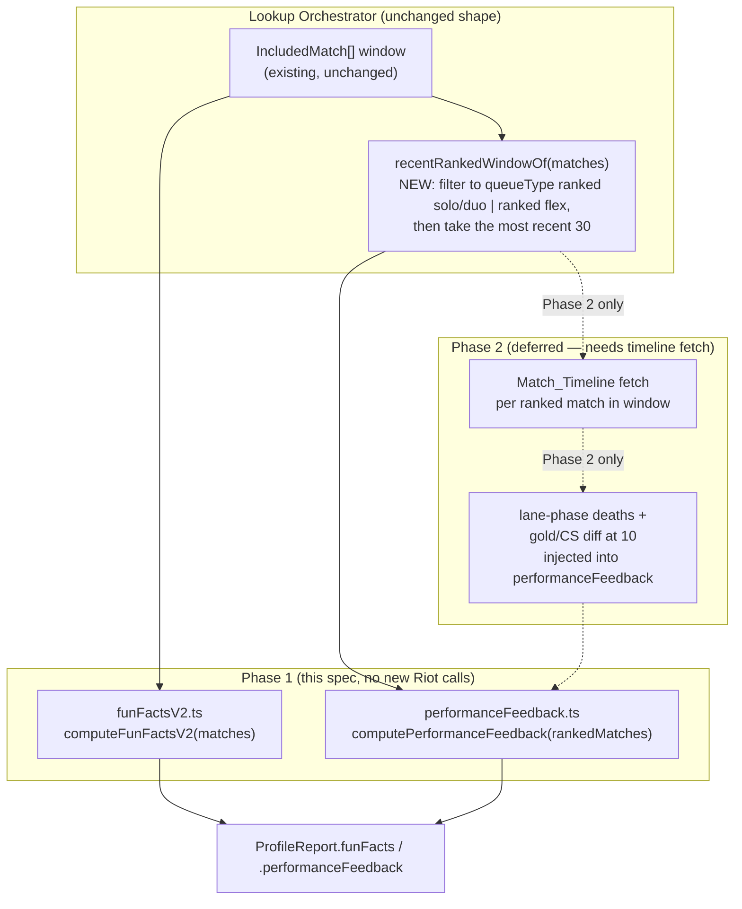
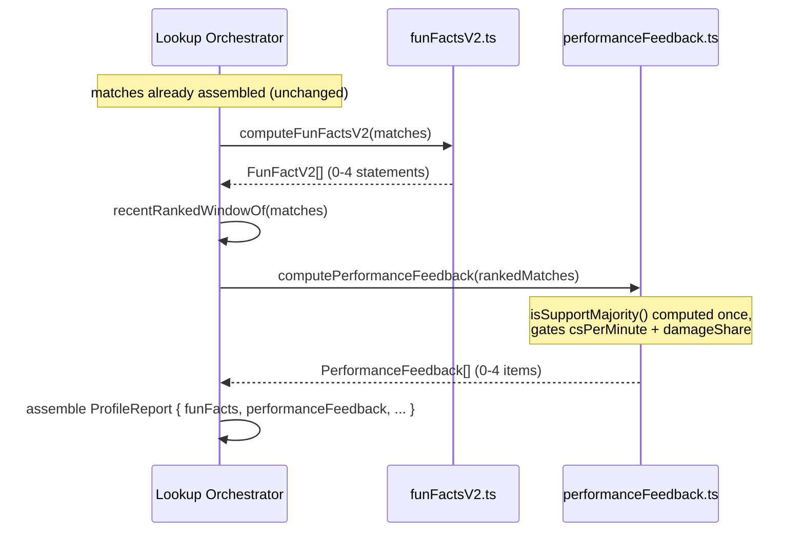

# Design Document

## Overview

This replaces two pure modules — `backend/src/insight/funFacts.ts` and `backend/src/insight/recommendations.ts` — with two new pure modules of the same shape: `funFactsV2.ts` and `performanceFeedback.ts`. Neither existing module is patched in place; both are deleted and rebuilt, per Requirement 1.

The two new modules keep this codebase's existing Insight Engine discipline exactly: no I/O, no clock, no network, everything derived from an `IncludedMatch[]` (or a narrower slice of it) the orchestrator already assembled. That discipline is what makes both modules property-testable without fakes, matching every other module in `backend/src/insight/`.

**Phase 1** (Requirements 2-14) needs no new Riot API call — everything it reads either already flows through `RawMatch`/`MatchParticipant` today, or is two small additive fields on a DTO the codebase already fetches for every match (ping counts, `neutralMinionsKilled`). **Phase 2** (Requirements 15-16) needs Match-V5's timeline for every ranked match in the window, which today is fetched for exactly one match at a time, on demand. That is a real, quantifiable increase in Riot API call volume per lookup, discussed in [Rate Limiting](#rate-limiting--phase-2-only) below — Phase 2 should not start until that trade-off is confirmed.

## Architecture



Key decisions:

- **`recentRankedWindowOf` is a new, tiny, pure filter-then-cap**, not a change to how `IncludedMatch[]` is assembled. Fun Facts keeps reading the full window (Requirement 6.6); only `computePerformanceFeedback`'s caller narrows its input, to Ranked_Matches only AND to the most recent `PERFORMANCE_FEEDBACK_WINDOW` (30) of them by `startTimestamp`. Capping at 30 rather than the full ranked history is deliberate: a player who fixed their vision-control habit two months ago and has been fine since shouldn't still see that feedback just because month-old ranked games are still inside a 100-match window — the whole point of Performance Feedback is to reflect current form, not a running lifetime average.
- **Confirmed 2026-09-01: Fun Facts also read `lanelessMatches` (ARAM / ARAM Mayhem)**, not only Summoner's Rift — "all the data we have", per user request. `computeFunFactsV2` takes an optional second `lanelessMatches` parameter (defaults to `[]`), adapts each `LanelessMatch` to the `IncludedMatch` shape (`role: ''`, `opponent: undefined`, since a Laneless_Match structurally has no lane), and folds the merged set into every category. This needs no per-category queueType gating: Nemesis already excludes any match with no `opponent`, so the adapted Laneless_Matches are automatically excluded from Nemesis by the same existing rule, while longestGame/favoriteItems/mostUsedPing — none of which depend on a lane — read the full merged set. Performance Feedback is unaffected: it still reads only `recentRankedWindowOf(matches)`, which by construction can never include a Laneless_Match (ARAM/ARAM Mayhem are never a Ranked_Match).
- **Role-aware suppression (Requirement 8) is computed once, inside `computePerformanceFeedback`**, from the ranked-only window — not from `ProfileStats.mostPlayedRole`, which is windowed over ALL queue types (Requirement 8.1 is explicit that the role determination is ranked-only). This mirrors the existing `roleAggregatesOf`/`mostPlayedRoleOf` pattern in `stats.ts`, just called with a pre-filtered array.
- **Phase 2 is architecturally a data-injection point, not a rewrite.** `computePerformanceFeedback` stays pure; if Phase 2 ships, the orchestrator fetches timeline-derived per-match aggregates (lane-phase death counts, gold/CS-at-10 diffs) BEFORE calling the pure function and passes them in as a second, optional argument — exactly how `MatchDetailWindow` data already flows into today's pure insight functions. No pure function reaches out for a timeline itself.

## Components and Interfaces

### `backend/src/insight/funFactsV2.ts` (new, replaces `funFacts.ts`)

```typescript
export interface FunFactV2 {
  category: 'nemesis' | 'longestGame' | 'favoriteItems' | 'mostUsedPing';
  text: string;
  /**
   * AMENDED during implementation (task 3.5): only present for `favoriteItems`.
   * The backend has no Static_Data_Provider dependency and cannot itself turn
   * an item id into a name/icon, but Requirement 4.6 requires the FRONTEND to
   * do exactly that — a frontend given only `text` would have no item ids to
   * resolve. `favoriteItems` carries the same `FavoriteItem[]` shape
   * `favoriteItemsOf` returns; `text` remains a readable fallback.
   */
  favoriteItems?: readonly FavoriteItem[];
}

export function computeFunFactsV2(
  matches: readonly IncludedMatch[],
  lanelessMatches?: readonly LanelessMatch[], // defaults to []
): FunFactV2[];

// Individual derivations, exported so tests assert numbers directly
// instead of parsing prose (same convention as funFacts.ts's exports):
export function nemesisOf(matches: readonly IncludedMatch[]): NemesisResult | undefined;
export function longestGameOf(matches: readonly IncludedMatch[]): IncludedMatch | undefined;
export function favoriteItemsOf(matches: readonly IncludedMatch[]): FavoriteItem[];
export function mostUsedPingOf(matches: readonly IncludedMatch[]): PingTally | undefined;
```

```typescript
export interface NemesisResult {
  championName: string;
  wins: number;
  losses: number;
  gamesPlayed: number;
  winRatePercent: number;
}

export interface FavoriteItem {
  itemId: number;
  count: number;
}

/** design.md's fixed tie-break order for Requirement 5.2, Riot's own field order in the Match-V5 schema. */
export const PING_FIELD_ORDER = [
  'allInPings', 'assistMePings', 'basicPings', 'commandPings', 'dangerPings',
  'enemyMissingPings', 'enemyVisionPings', 'getBackPings', 'holdPings',
  'needVisionPings', 'onMyWayPings', 'pushPings', 'retreatPings', 'visionClearedPings',
] as const;
export type PingField = (typeof PING_FIELD_ORDER)[number];

export interface PingTally {
  field: PingField;
  count: number;
}
```

`computeFunFactsV2` produces one statement per eligible category (Requirements 2-5), in the fixed order **nemesis, longestGame, favoriteItems, mostUsedPing** — the same "one per eligible category, no padding" shape `computeFunFacts` already used, just with new categories. Requirement 4's boots exclusion list and Requirement 5's ping fields both live in this module (see Data Models).

### `backend/src/insight/performanceFeedback.ts` (new, replaces `recommendations.ts`)

```typescript
export type PerformanceFeedbackCategory =
  | 'csPerMinute'
  | 'damageShare'
  | 'killParticipation'
  | 'jungleObjectives';
  // Phase 2 adds: 'lanePhaseDeaths' | 'earlyGameDeficit'

export interface PerformanceFeedback {
  category: PerformanceFeedbackCategory;
  text: string;
  metricName: string;
  metricValue: number;
  /** What the value was compared against — surfaced so the UI/tests can show the benchmark without re-deriving it. */
  benchmarkValue: number;
}

/** Requirement 6: Ranked_Matches only, then the most recent PERFORMANCE_FEEDBACK_WINDOW (30) by startTimestamp descending. Fewer than 30 available -> all of them, never padded. */
export const PERFORMANCE_FEEDBACK_WINDOW = 30;
export function recentRankedWindowOf(matches: readonly IncludedMatch[]): IncludedMatch[];

export function computePerformanceFeedback(
  rankedMatches: readonly IncludedMatch[],
): PerformanceFeedback[];

// Individual triggers, same "returns undefined when it doesn't fire" shape
// as survivabilityRecommendationOf/etc. in the removed recommendations.ts:
export function csPerMinuteFeedbackOf(rankedMatches: readonly IncludedMatch[]): PerformanceFeedback | undefined;
export function damageShareFeedbackOf(rankedMatches: readonly IncludedMatch[]): PerformanceFeedback | undefined;
export function killParticipationFeedbackOf(rankedMatches: readonly IncludedMatch[]): PerformanceFeedback | undefined;
export function jungleObjectivesFeedbackOf(rankedMatches: readonly IncludedMatch[]): PerformanceFeedback | undefined;
```

`computePerformanceFeedback`'s shape mirrors `computeRecommendations` exactly: a `Record<category, Feedback | undefined>` built once, then walked in `PERFORMANCE_FEEDBACK_CATEGORY_ORDER` (**csPerMinute, damageShare, killParticipation, jungleObjectives** — CS and damage first since Requirement 8's Support suppression applies to exactly those two, so keeping them adjacent in the declared order keeps the suppression rule easy to read against the list) to build a deterministic, capped-length array. `csPerMinuteFeedbackOf`/`damageShareFeedbackOf` internally call the shared `isSupportMajority(rankedMatches)` helper (Requirement 8) and return `undefined` immediately when it's true — the suppression is inside the per-category function, not a filter applied after the fact, so a test calling `csPerMinuteFeedbackOf` directly on a Support player's matches sees the same `undefined` the assembled list would.

### DTO additions (`backend/src/riotApiClient/index.ts`, `matchProjection.ts`)

Requirement 14. Both fields are additive to `MatchParticipantDto`:

```typescript
export interface MatchParticipantDto {
  // ...existing fields unchanged...
  neutralMinionsKilled?: number; // already summed into csOf() elsewhere; now also kept on its own
  onMyWayPings?: number;
  enemyMissingPings?: number;
  enemyVisionPings?: number;
  needVisionPings?: number;
  pushPings?: number;
  holdPings?: number;
  getBackPings?: number;
  assistMePings?: number;
  allInPings?: number;
  retreatPings?: number;
  dangerPings?: number;
  basicPings?: number;
  commandPings?: number;
  visionClearedPings?: number;
}
```

`matchProjection.ts`'s `PARTICIPANT_KEYS` gains all fourteen ping field names plus `neutralMinionsKilled` (it is already read internally by `csOf()` in `orchestrator/mapping.ts`, but was never itself copied onto the projected/cached `MatchDto` — it has to be, for Requirement 12 to read it per-participant across the whole `Full_Lobby`, not just for the analyzed player's own row).

`stats.ts`'s `MatchParticipant` (the `match-detail-tabs` all-ten-participants type) gains the same fields, and `orchestrator/mapping.ts`'s `toMatchParticipant` copies them through — same pattern as `championId` was added for `clash-scouting`.

### Orchestrator wiring (`backend/src/orchestrator/index.ts`)

```typescript
// in assembleReport():
funFacts: computeFunFactsV2(matches, lanelessMatches),                   // Requirement 6.4 — full window, all queue types we have
performanceFeedback: computePerformanceFeedback(recentRankedWindowOf(matches), earlyGame), // Requirement 6.1 — ranked, most recent 30 only
```

Both calls replace the existing `funFacts: computeFunFacts(matches)` / `recommendations: computeRecommendations(matches, stats)` lines one-for-one. `computePerformanceFeedback` needs no `stats` argument at all (unlike the removed `computeRecommendations`, which accepted but never used one — see that module's decision comment) since every quantity it needs is a per-match aggregate over `rankedMatches`.

**Per-queue slices are unaffected.** `ProfileReport.statsByQueue`/`rolePerformanceByQueue` continue to be computed once per `QueueFilterValue` exactly as today; `funFacts`/`performanceFeedback` are top-level `ProfileReport` fields (like the removed `funFacts`/`recommendations` were), not queue-filtered — Requirement 6 already scopes Performance Feedback's OWN data source to ranked games, so there is no separate "Performance Feedback per queue filter" concept to build.

## Data Models

```typescript
/** ProfileReport gains these two fields, replacing funFacts/recommendations. */
interface ProfileReport {
  // ...existing fields unchanged...
  funFacts: FunFactV2[];
  performanceFeedback: PerformanceFeedback[];
}
```

**Boots exclusion list (Requirement 4.2).** A hardcoded `BOOT_ITEM_IDS: ReadonlySet<number>` in `funFactsV2.ts`, covering the Season 15 boot line (Boots of Speed 1001, and every upgrade: Berserker's Greaves, Boots of Swiftness, Ionian Boots of Lucidity, Mercury's Treads, Plated Steelcaps, Sorcerer's Shoes, Symbiotic Soles, Gunmetal Greaves) plus their next-generation "Mythic boots" enchants if the live game currently has them active. **This list WILL drift as Riot changes item lines patch to patch** — same honesty this codebase already applies to the stat-shard and ARAM-Mayhem-augment tables in `README.md`'s Assets section, worth a comment pointing at the same kind of periodic-recheck obligation. It is intentionally not sourced from `item.json` (a Data Dragon file the *frontend* fetches; the backend Insight_Engine has no static-data dependency and Requirement 4's decision below explains why that should stay true).

**Why item names/icons aren't resolved here.** `favoriteItemsOf` returns bare item ids, exactly like `ItemBuild.items` already does everywhere else in this codebase — the Static_Data_Provider that turns an id into a name/icon is a frontend-only concept (`visual-assets` spec), and the backend Insight_Engine has never depended on it. The frontend renders each reported id through the same `ItemBuildRow`/`CdnImage` machinery every other item id in the report already goes through.

**Why ping labels aren't resolved here either.** Same reasoning: `mostUsedPingOf` returns the raw Riot field name (`PingField`), and a small frontend-only label map (`domain/pings.ts`, mirroring `domain/liveGame.ts`'s `queueLabel`) turns `onMyWayPings` into "On My Way" for display.

## Sequence Flow



## Rate Limiting — Phase 2 only

Phase 1 issues **zero** additional Riot API calls — every field it reads is already present in the `MatchDto` this codebase fetches for each included match today; Requirement 14's two DTO additions are read from a payload already in hand, not a new request.

Phase 2 (Requirements 15-16) needs a `Match_Timeline` per match in the Recent_Ranked_Window. Today, `item-timeline`'s Build Path tab fetches exactly one timeline, on demand, per visitor click. The 30-match cap (Requirement 6) already bounds this to at most **30x**, not 100x, but that is still a real increase in timeline calls for one lookup — timelines are 0.3-1 MB raw responses (see `item-timeline` design.md), so this is not a call-count concern alone; it is also a meaningful latency and memory cost per lookup if done eagerly.

Before Phase 2 starts, the options are:

1. **Bound the window.** Only compute Requirements 15-16 over the most recent `N` ranked matches (e.g. 10-20), not the whole match history — the same bounding strategy `clash-scouting`'s Recent_Form already uses for exactly this reason.
2. **Make it lazy/on-demand**, the same way Build Path already is — e.g. a "load early-game stats" action the visitor triggers explicitly, rather than something baked into every report assembly.
3. **Cache aggressively.** A completed match's timeline is immutable, so a derived per-match aggregate (lane-phase death count, gold/CS-at-10 diff) can be cached indefinitely once computed, the same way `timelineSlice` already is for Build Path — the cost is only ever paid once per match, not once per lookup.

This design does not pick one of the three for the user — it is the open question Requirement 15.1/16.1 point back to here for.

**Confirmed 2026-09-01: options 1 + 3 together ("Bounded + cached").** Implemented as:

- `EARLY_GAME_MATCH_LIMIT = 10` (`orchestrator/index.ts`) — Requirement 15-16 aggregates are computed for only the 10 most recent matches within the (already 30-capped) Recent_Ranked_Window, never the whole window.
- Computation is **eager**, not lazy (option 2 rejected) — part of every fresh-path report assembly, gated by the same 15s budget gate (`BudgetGate.expired()`) every other fresh-path step already respects, so a slow Riot response degrades gracefully to fewer/zero early-game aggregates rather than blowing the lookup's overall time budget.
- Each derived per-match, per-puuid aggregate (`{ matchId, lanePhaseDeaths, goldDiffAt10, csDiffAt10 }`) is cached **indefinitely** under a new `earlyGameSlice` cache endpoint (`orchestrator/earlyGame.ts`), keyed `{ matchId, puuid }` — so the cost is paid at most once per (match, player) pair ever, matching option 3. The raw 0.3-1MB `Match_Timeline` itself is never cached, mirroring `item-timeline`'s `timelineSlice` precedent.
- A failed/unavailable timeline fetch is deliberately **not** cached (retried on the next lookup), while a successfully computed aggregate — even one whose fields are `null` because no Lane_Opponent exists — is always cached, since that `null` is a fact about the match, not a transient Riot hiccup.
- Confirmed against the real assembled stack, not just unit tests: `endToEnd.test.ts`'s repeat-lookup test (Requirement 10.5) shows a second lookup of the same player issues zero additional Match-Timeline calls beyond the first lookup's, proving the cache is actually load-bearing on a full pipeline run.

## Error Handling

| Trigger | Behavior |
|---|---|
| No Lane_Opponent recorded for a match (Requirement 2) | That match does not contribute to Nemesis's per-champion tally; not a failure. |
| No champion meets `NEMESIS_MIN_GAMES` | Nemesis fact omitted entirely (Requirement 2.4). |
| No non-boot, non-empty item ever recorded (Requirement 4) | Favorite Items fact omitted. |
| Every ping total is zero (Requirement 5) | Most-Used Ping fact omitted, not reported as an arbitrary zero-count field. |
| Zero Ranked_Matches at all (Requirement 6.5) | `performanceFeedback: []`; frontend shows the ranked-games-needed notice (Requirement 13.4), distinct from "nothing stood out". |
| Fewer than 30 Ranked_Matches exist (Requirement 6.4) | Recent_Ranked_Window is simply all of them — not an error, not padded. |
| A Ranked_Match has no Full_Lobby (Requirements 10, 11, 12) | Excluded from that category's per-match aggregate; not treated as a zero value, exactly the degradation `match-detail-tabs` Requirement 6.11 already established for missing lobby data. |
| No enemy jungler identifiable in an otherwise-Full_Lobby jungle match (Requirement 12.3) | That match excluded from the jungle-objectives computation only; does not affect any other category. |
| Support-majority player (Requirement 8) | `csPerMinuteFeedbackOf`/`damageShareFeedbackOf` both return `undefined` unconditionally — no numeric check even runs. |
| (Phase 2) Timeline fetch fails or is unavailable for a ranked match | That match excluded from lane-phase-deaths / early-game-deficit computation only; never treated as zero deaths or zero deficit. |

## Correctness Properties

Mirrors this codebase's existing property-testing convention (`funFacts.property.test.ts`, `recommendations.property.test.ts` equivalents), tagged `// Feature: player-insights, Property {n}: {text}`.

### Property 1: Fun Facts are pure and produce at most one statement per category

For any `IncludedMatch[]`, `computeFunFactsV2` called twice on the same input yields deeply-equal results, the output never exceeds 4 statements, and each category (`nemesis`/`longestGame`/`favoriteItems`/`mostUsedPing`) appears at most once.

**Validates: Requirements 1.5 (no dead old-category output possible — the type itself is closed), 2, 3, 4, 5.**

### Property 2: Nemesis is the true minimum-win-rate champion among eligible opponents

For any set of matches with Lane_Opponents, the champion `nemesisOf` names has a win rate less than or equal to every OTHER champion that met `NEMESIS_MIN_GAMES`, and ties are broken by higher game count then by name ascending, exactly as Requirement 2.3 declares.

**Validates: Requirement 2.**

### Property 3: Performance Feedback never emits an untriggered category, and Support suppression is absolute

For any `IncludedMatch[]` and any assignment of per-match role/CS/damage/KP/jungle values, `computePerformanceFeedback` never includes `csPerMinute`/`damageShare` when the ranked-window most-played role is Support, and every OTHER emitted category's own trigger condition (Requirements 9, 10 [role check only], 11, 12) independently holds for the matches that produced it.

**Validates: Requirements 7, 8, 9, 10, 11, 12.**

### Property 4: Performance Feedback reads only the Recent_Ranked_Window

For any `IncludedMatch[]` containing a mix of queue types and timestamps, `computePerformanceFeedback`'s result is identical whether it is called on `recentRankedWindowOf(matches)` directly or on `matches` with (a) every non-ranked match's numeric fields, and (b) every ranked match OLDER than the 30 most recent, corrupted to arbitrary values — i.e. neither non-ranked matches nor stale ranked matches beyond the 30-match cap can influence the result.

**Validates: Requirement 6.**

### Property 5: Phase 2 categories mirror their own functions and read only in-window `earlyGame` entries

For any `IncludedMatch[]` and any array of `EarlyGameAggregate` (one per match, each field independently nullable), `computePerformanceFeedback(rankedMatches, earlyGame)`'s `lanePhaseDeaths`/`earlyGameDeficit` entries are identical to calling `lanePhaseDeathsFeedbackOf`/`earlyGameDeficitFeedbackOf` directly; dropping or corrupting any `earlyGame` entry whose `matchId` falls outside the Recent_Ranked_Window never changes either category's result; and an empty `earlyGame` array never triggers either category.

**Validates: Requirements 15, 16.**

## Testing Strategy

**Property-based testing**: `fast-check`, minimum 100 runs per property, same tagging convention as every other spec in this codebase.

**Unit/example tests** (mirroring `funFacts.test.ts`/`recommendations.test.ts`'s existing style):
- Nemesis: below-threshold champion excluded; tie broken by game count then name.
- Longest game: tie broken by most recent.
- Favorite items: boots excluded; empty-slot (`0`) excluded; tie broken by item id ascending.
- Most-used ping: all-zero case omits the fact; tie broken by `PING_FIELD_ORDER`.
- CS/min: exactly-at-benchmark does NOT trigger (strict `<`); Support player never triggers regardless of value.
- Damage share: match with no Full_Lobby excluded from the average, not zeroed.
- Kill participation: `'N/A'` rows excluded, not treated as 0%.
- Jungle objectives: non-jungle matches never considered; a jungle match with no identifiable enemy jungler excluded.
- Ranked-only filter: a normal-game-only window yields `performanceFeedback: []` regardless of how bad those normal games were.

**Integration tests**: one full `assembleReport` pass asserting `ProfileReport.funFacts`/`performanceFeedback` are populated end to end from a realistic mixed-queue, mixed-role match fixture — same shape as existing orchestrator integration coverage.

**Frontend tests**: the three new empty/notice states (Requirement 13.3/13.4/13.5) each render distinctly and are distinguishable by `data-testid`, the same convention `no-recent-matches`/`no-ranked-entries`/etc. already use elsewhere in `ProfileReportView.tsx`.

## Open Questions

1. **Damage-share threshold (80% of teammate average) and jungle-objective threshold (80% of enemy jungler average, Requirements 10.3/12.5)** are this design's own interpretation choices, not values the user specified (unlike CS/min's explicit 8.5). Confirm or tune before implementation locks them in as constants other code starts depending on.
2. **Kill-participation benchmark (50%, Requirement 11.3)** is likewise this design's choice — no cross-player baseline is available to a pure module (the same constraint the removed `recommendations.ts` decision 2 already documented), so a flat benchmark is the only option without inventing a new baseline population.
3. **Resolved 2026-09-01.** Phase 2 thresholds implemented as `LANE_PHASE_DEATH_BENCHMARK = 2` and `EARLY_GAME_GOLD_DEFICIT_THRESHOLD = 300` gold (this design's own interpretation choices, same caveat as Open Questions 1-2 — not user-specified, revisit if real usage suggests miscalibration); the bounding/laziness/caching strategy is the user-confirmed "Bounded + cached" recorded in [Rate Limiting](#rate-limiting--phase-2-only) above.
4. **Should Performance Feedback respect the `QueueFilterValue` gamemode filter** the sidebar already has (`report.statsByQueue`), narrowing further to "ranked solo/duo only" or "ranked flex only" when that filter is selected? Requirement 6 as written scopes it to "ranked games" broadly (both ranked queues combined); this is a plausible follow-on but is out of this spec's scope unless confirmed.
