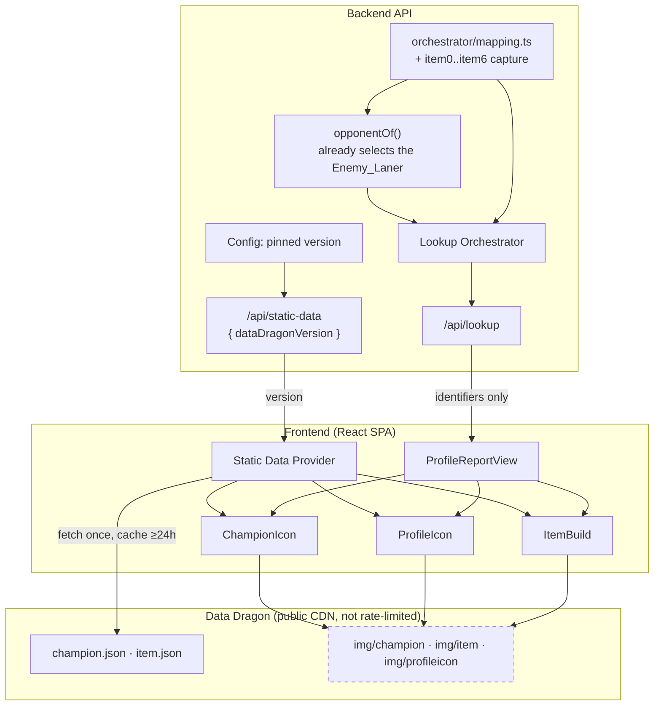
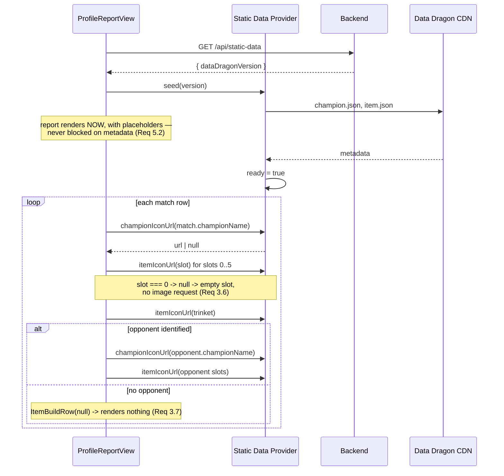

# Design Document

## Overview

Three asset classes, one provider, and one genuine piece of backend work.

Rendering champion icons and the profile icon is almost entirely a frontend concern, because the identifiers are already in the response. `championName` on a match, an opponent, and a top-champion entry is Riot's internal Champion_Key — `Aatrox`, `MonkeyKing`, `Chogath` — which is exactly the stem Data_Dragon serves champion images under. `profileIconId` is already carried on the `ProfileReport`. Neither needs a new Riot call, a new cache entry, or a rate-limit reservation. What they need is a pinned version, a base URL, and a metadata file that turns `MonkeyKing` into `Wukong`.

Item images are different, and this is where the work is. Match-V5's participant record carries `item0` through `item6`; `backend/src/orchestrator/mapping.ts` captures none of them. They must be added to the participant flattening on both sides of the matchup before the frontend has anything to render. The Enemy_Laner side is cheap because the hard part is already done: `opponentOf` already selects the opposing participant sharing the player's lane and already returns `undefined` when no lane could be determined, so item capture rides along on a selection that exists and is already tested.

Two decisions are worth stating up front because they are the ones a reader is most likely to want justified.

**Identifiers cross the API; URLs do not.** The backend returns raw identifiers and a version; the frontend constructs every URL. Baking absolute CDN URLs into API responses would make the Data_Dragon version a property of the payload rather than of the render, so bumping a patch would mean re-deriving responses instead of changing one config value — and would put a versioned third-party host inside data the application otherwise owns.

**The version is served, not built in.** Requirement 4.3 asks for the version to reach the frontend at runtime. A build-time `VITE_` variable would work but would make a patch bump a frontend rebuild and a redeploy, and would let the two workspaces disagree about the version with nothing to detect it. A tiny backend endpoint makes the backend's configuration the single source of truth.

## Architecture



Key architectural decisions:

- **The Static_Data_Provider is a frontend component.** It resolves identifiers to URLs and names for rendering, which is a render concern. Putting it in the backend would mean either shipping URLs in responses (rejected above) or proxying images (rejected by Requirement 4.6 — it would put a CDN's traffic through an application server for no benefit).
- **Images are never proxied.** Data_Dragon is built to be hot-linked and is not rate-limited. Proxying would add latency, bandwidth cost, and a cache the browser already has, and would mean the application rehosts Riot's assets — which Requirement 7.3 forbids.
- **`item6` is modelled as a slot, not special-cased at the render site.** It is a trinket, and Requirement 3.5 wants it visually distinct. Encoding that in the data shape (a `trinket` field beside a six-item array) rather than as "index 6 means something else" keeps the distinction from being re-derived at every call site.
- **Zero is not an item.** Item slot `0` means empty. Requirement 3.6 forbids requesting an image for it, and this is the single most common way a match history renders as a row of broken-image icons.
- **Absent is not zero.** `profileIconId` is currently coerced with `finiteOrZero`, which maps an absent value to `0` — but `0` is a valid profile icon that renders a real picture. That conflation makes missing data indistinguishable from a specific icon, and Requirement 2.2 removes it.

## Components and Interfaces

### Backend: item capture in `mapping.ts`

The participant flattening gains the seven slots, applied identically to the analyzed player and to the participant `opponentOf` selects.

```typescript
interface ItemBuild {
  /** Item_Slots 0-5. Zero means an empty slot and is preserved, not filtered. */
  items: readonly [number, number, number, number, number, number];
  /** Item_Slot 6. Zero means no trinket. */
  trinket: number;
}

function itemBuildOf(participant: MatchParticipantDto): ItemBuild;
```

`itemBuildOf` is total and never throws, matching the existing module's contract: a malformed or absent slot becomes `0`, which is already the encoding for "empty". Zeros are preserved rather than filtered so that slot positions stay stable — filtering them would make a player with a gap in their inventory render their items in the wrong positions.

### Backend: static data version endpoint

```
GET /api/static-data  ->  200 { "dataDragonVersion": "15.1.1" }
```

Reads the pinned version from configuration (Requirement 4.1, 4.3). No Riot call, no cache entry, no rate-limit reservation — it returns a configured string.

### Frontend: Static Data Provider

```typescript
interface StaticDataProvider {
  /** `MonkeyKing` -> `Wukong`; falls back to the key itself (Requirement 1.4). */
  championDisplayName(key: string): string;
  /** Null when the key is empty or unknown — callers render a placeholder. */
  championIconUrl(key: string): string | null;
  /** Null when the id is absent or unknown. Note: 0 is a VALID icon. */
  profileIconUrl(id: number | null): string | null;
  /** Null when the id is 0 (empty slot) or unknown. */
  itemIconUrl(id: number): string | null;
  /** Falls back to the numeric id as a string (Requirement 6.3). */
  itemDisplayName(id: number): string;
  /** False until metadata has loaded; the report renders regardless. */
  readonly ready: boolean;
}
```

Seeded with the version from `GET /api/static-data`, then fetches `champion.json` and `item.json` once and holds them for at least 24 hours (Requirement 4.4). Every accessor is total: it returns a URL or `null`, a name or a fallback, never an empty string and never a malformed URL. That totality is what makes Requirement 5.3 — never render an image element whose source could not be constructed — enforceable by the callers rather than by discipline.

`ready` is deliberately exposed and deliberately non-blocking. Requirement 5.2 says a Data_Dragon failure must leave the report fully readable, so the report renders immediately with placeholders and fills in when metadata arrives.

### Data Dragon URL construction

| Asset | URL | Identifier source |
|---|---|---|
| Champion icon | `{base}/cdn/{version}/img/champion/{Champion_Key}.png` | `championName` on a match, opponent, or top-champion entry |
| Profile icon | `{base}/cdn/{version}/img/profileicon/{id}.png` | `profileIconId` on the report |
| Item icon | `{base}/cdn/{version}/img/item/{id}.png` | `item0`–`item6` on a participant |
| Champion metadata | `{base}/cdn/{version}/data/en_US/champion.json` | — |
| Item metadata | `{base}/cdn/{version}/data/en_US/item.json` | — |

`{base}` is `https://ddragon.leagueoflegends.com`.

Two facts this design depends on and which **must be confirmed against the live CDN before the provider is built** (task 1.1): that Data_Dragon serves `Access-Control-Allow-Origin: *` on the metadata JSON files, without which the frontend cannot fetch them directly and the design needs a backend fetch instead; and that `champion.json`'s entries key the Champion_Key to a display `name`. Both are long-standing behaviours, but neither is verified in this document, and the provider's shape depends on the first.

### Frontend: rendering components

```typescript
function ChampionIcon(props: { championKey: string; size: number }): JSX.Element;
function ProfileIcon(props: { profileIconId: number | null; size: number }): JSX.Element;
function ItemBuildRow(props: { build: ItemBuild | null; size: number }): JSX.Element | null;
```

`ItemBuildRow` returns `null` for a null build, which is how Requirement 3.7 — render no opposing build and no empty opposing slots when there is no Enemy_Laner — is satisfied without the caller testing for it.

Each component renders an Asset_Placeholder of the same dimensions when its URL resolves to `null` (Requirement 5.1). Reserving the box regardless of whether the image loads is what keeps a CDN failure from reflowing the page.

## Data Models

Additions to the existing shapes. Everything else is unchanged.

```typescript
interface RecentMatchSummary {
  // ... existing fields unchanged ...
  /** Requirement 3.1. */
  build: ItemBuild;
  /** `null` when no opposing participant shared this player's lane. */
  opponent: OpponentSummary | null;
}

interface OpponentSummary {
  // ... existing fields unchanged ...
  /** Requirement 3.2 — from the SAME participant row opponentOf selected. */
  build: ItemBuild;
}

interface ProfileReport {
  // ... existing fields unchanged ...
  /**
   * Requirement 2.2. Was `number` coerced through finiteOrZero; 0 is a valid
   * icon, so an absent value must be null rather than collapsed onto a real one.
   */
  profileIconId: number | null;
}
```

`ChampionSummary.championName` and `RecentMatchSummary.championName` are unchanged — they already carry the Champion_Key, and the rename to a display name happens at render time rather than in the payload, so the API keeps returning Riot's identifier rather than a localised string.

### Interaction with `lookup-pipeline-fixes`

That spec independently makes `profileIconId` nullable, for a different reason — it demotes Summoner-V4 to a non-blocking enrichment call, so the field can be absent because the call failed. This spec needs the same nullability for a third reason: `0` is a real icon and must not stand in for "unknown".

The two are compatible and additive, and whichever lands first satisfies the type change for the other. What must not happen is one of them landing and the other's rationale being lost — if `profileIconId` is made nullable only because Summoner-V4 might fail, a later change that restores Summoner-V4 to the required set would look free to revert it, and would silently reintroduce the zero-conflation. Requirement 2.2 exists so that reason survives on its own.

## Sequence Flow: Rendering a Match History Row



## Error Handling

| Trigger | Behavior | Visitor sees |
|---|---|---|
| Champion_Key empty or absent on a match | `championIconUrl` returns null | Placeholder icon, raw key as name |
| Champion_Key unknown to the pinned version | `championIconUrl` returns null | Placeholder icon, raw key as name |
| `profileIconId` null (Summoner-V4 failed, or absent) | `profileIconUrl` returns null | Placeholder avatar |
| Item slot is `0` | `itemIconUrl` returns null; no request issued | Empty slot, correctly positioned |
| Item id unknown to the pinned version | `itemIconUrl` returns null | Placeholder slot, numeric id as the text alternative |
| No Enemy_Laner identified for a match | `opponent` is null; `ItemBuildRow` renders nothing | No opposing build for that row |
| `GET /api/static-data` fails | Provider never becomes ready | Full report, every image a placeholder |
| `champion.json` / `item.json` fetch fails | Provider never becomes ready | Full report, every image a placeholder |
| An individual image 404s at the CDN | Browser-level; the reserved box remains | Placeholder in a correctly sized box, no reflow |

The last row is why Requirement 5.1 specifies equal dimensions rather than merely "a placeholder". A match history is a dense grid; an image that fails after layout has settled will reflow every row beneath it unless its box was reserved.

## Correctness Properties

### Property 1: Item slot rendering is positional and never requests an empty slot

For any seven-tuple of item identifiers, the rendered build contains exactly six item positions and one trinket position, in the order given; every position whose identifier is `0` renders an empty slot with no image source constructed and no request issued; and every position whose identifier is non-zero and resolvable renders an image whose URL is built from that identifier and the pinned version. No non-zero identifier is ever dropped, and no zero is ever filtered in a way that shifts a later slot's position.

**Validates: Requirements 3.3, 3.5, 3.6**

### Property 2: Asset URL resolution is total

For any Champion_Key including the empty string, any profile icon identifier including null and zero, and any item identifier including zero, every Static_Data_Provider accessor returns either a well-formed URL containing the pinned Data_Dragon_Version or `null` — never an empty string, never a URL containing `undefined`, `null`, or an unresolved version, and never a throw. This holds both before and after metadata has loaded.

**Validates: Requirements 4.1, 4.2, 5.3, 5.4**

### Property 3: Every rendered asset has a non-empty text alternative

For any Champion_Key, item identifier, or profile icon identifier, the text alternative the System renders is non-empty: the display name when it resolves, the raw identifier when it does not, and a description of what is missing when a placeholder is rendered in its place.

**Validates: Requirements 6.1, 6.2, 6.3, 6.4**

### Property 4: Champion display names fall back without ever being empty

For any Champion_Key present in the pinned version's metadata, `championDisplayName` returns that champion's display name; for any key absent from it, including the empty string, it returns the key unchanged; and the result is never empty unless the key itself was empty, in which case a placeholder's own text alternative is used instead.

**Validates: Requirements 1.3, 1.4, 6.2**

### Property 5: An opponent's build always comes from the opponent's own participant row

For any Match-V5 match detail and any analyzed player within it, if an Enemy_Laner is identified then the opposing build rendered is exactly the seven Item_Slots of that identified participant, drawn from a participant row distinct from the analyzed player's; and if no Enemy_Laner is identified then no opposing build and no opposing slots are rendered at all.

**Validates: Requirements 3.2, 3.7, 3.9**

## Testing Strategy

**Property-based testing**: `fast-check`, minimum 100 runs per property, tagged `// Feature: visual-assets, Property {n}: {property text}`.

Property 1 and Property 5 are the two that most need generators. Property 1 quantifies over every arrangement of zeros and non-zeros across seven slots — the positional bug it guards against (filtering empties and shifting later items left) is invisible in any example where the empty slots happen to be trailing, which is the common case and therefore exactly what a hand-written example set would contain. Property 5 guards against the opposing build being read from the wrong participant row, which in a ten-participant match is a bug that produces plausible-looking wrong data rather than an obvious failure.

Property 2's generators must include the empty string, `null`, `0`, negative values, and identifiers absent from the metadata, and must run both before and after the provider is ready. The failure it guards against — a URL containing the literal `undefined` — renders as a broken image rather than as an error, so nothing else would catch it.

**Unit/example tests**:
- `itemBuildOf` on a participant with malformed, absent, and out-of-range slot values (3.1).
- Trinket rendered distinctly from items 0–5 (3.5).
- No opposing build rendered when `opponent` is null (3.7).
- Placeholder dimensions equal the asset they replace (5.1).
- Full report renders with every image a placeholder when `GET /api/static-data` fails (5.2).
- `profileIconId` of `0` renders a real icon, and `null` renders a placeholder — the two are distinguishable (2.2, 2.3).
- Attribution present and no ad slots on pages rendering assets (7.1, 7.2).
- No image request is issued for a zero item slot, asserted by counting constructed sources rather than by inspecting the DOM (3.6).

**Integration test**: a Profile_Report containing a match with a full six-item build plus trinket, a match with three empty slots interleaved among items, a match with no Enemy_Laner, and a match whose `championName` is empty — asserting correct slot positions, an absent opposing build, and placeholders where expected.

**Live verification** (manual, one run, task 1.1): confirm Data_Dragon serves `Access-Control-Allow-Origin: *` on `champion.json` and `item.json`, and confirm the `champion.json` entry shape that maps a Champion_Key to its display name. The provider's location — frontend versus backend — depends on the first, so it is checked before the provider is written rather than after.

**Out of scope**: item purchase order and build timing, which require Match-V5's timeline endpoint rather than the participant record and would carry their own payload-size and caching consequences; champion splash art and loading screens; and rune and summoner-spell icons, which use the same provider and can be added to it without changing this design.
